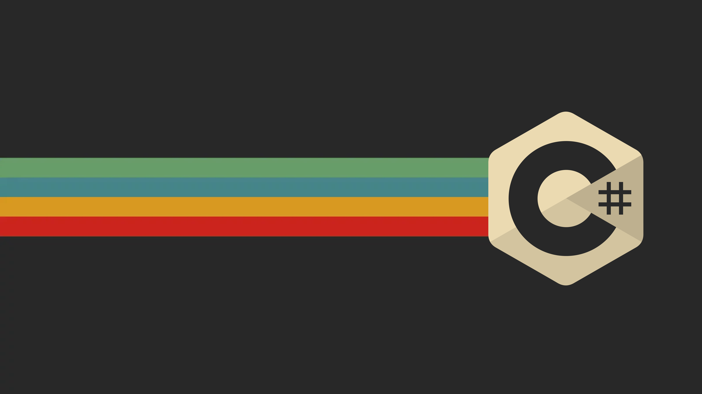

# C# Programming Language

**C#** (dibaca:  ***see sharp*** ) adalah sebuah bahasa pemrograman berorientasi objek ( *object-oriented language* ) yang dikembangkan oleh **Microsoft** sebagai bagian dari inisiatif kerangka **.NET Framework**. Bahasa pemrograman ini dibuat berbasiskan bahasa C++ yang telah dipengaruhi oleh aspek-aspek ataupun fitur bahasa yang terdapat pada bahasa-bahasa pemrograman lainnya seperti Java, Delphi, VisualBasic, dan lain-lain dengan beberapa penyederhanaan. Menurut standar ***ECMA-334 C# Language Specification***, nama C# terdiri atas sebuah huruf Latin C **(**U+0043**)** yang diikuti oleh tanda pagar yang menandakan angka # (U+0023). Tanda pagar # yang digunakan memang bukan tanda kres dalam seni musik (U+266F), dan tanda pagar # (U+0023) tersebut digunakan karena karakter kres dalam seni musik tidak terdapat di dalam papan tombol standar.



> Sumber: Wikipedia

**Alasan-alasan Kenapa Menggunakan C# :**

* Dukungan ekosistem yang besar menggunakan .NET Runtime.
* Fitur, sintaks dan keyword lebih lengkap dibandingkan bahasa lain.
* Kematangan bahasa dari segi peforma dan ekosistem.

**Karakteristik C# :**

- **Ekstensi File**: C# menggunakan ekstensi file .cs
- **Multi-threading**: C# mendukung pemrograman konkuren dan parallel, menggunakan Task Parallel Library (TPL) dan async-await.
- **Statically typed**: C# bahasa yang statically typed, yang berarti Anda harus mendefinisikan tipe variabel sebelum penggunaan.
- **Type inference**: C# mendukung type inference, memungkinkan tipe data secara otomatis terdeteksi saat variabel diinisialisasi.
- **String Interpolation**: C# mendukung string interpolation langsung ke dalam string tanpa menggunakan concatenation.
- **Paradigma**: C# mendukung paradigma pemrograman berorientasi objek (OOP) dan fungsional dalam beberapa cara.
- **Opsi Kompilasi**: C# dikompilasi ke dalam intermediate language (IL) yang kemudian diterjemahkan menjadi kode mesin oleh Common Language Runtime (CLR) dan dapat di kompilasi ke native AOT.
- **SDK**: C# memiliki SDK yang menyediakan alat untuk mengembangkan, menguji, dan membangun aplikasi dalam bahasa tersebut.

**Komentar**:

Komentar dalam C# dapat ditambahkan menggunakan `//` untuk komentar satu baris, `/* */` untuk komentar multi-baris, dan `///` untuk komentar dokumentasi.

```csharp
// Ini adalah contoh komentar satu baris
int x = 5; // Komentar ini menjelaskan bahwa nilai x adalah 5

/*
Ini adalah contoh komentar
banyak baris.
Komentar ini bisa menjangkau beberapa baris
dan digunakan untuk memberikan penjelasan lebih detail.
*/

/// <summary>
/// Method ini digunakan untuk menghitung jumlah dua bilangan bulat.
/// </summary>
/// <param name="a">Bilangan bulat pertama.</param>
/// <param name="b">Bilangan bulat kedua.</param>
/// <returns>Hasil penjumlahan dua bilangan.</returns>
public int Add(int a, int b)
{
    return a + b;
}
```

## Installation

**Environment yang dibutuhkan:**

- **.NET SDK**: [https://dotnet.microsoft.com/download/dotnet](https://dotnet.microsoft.com/download/dotnet ".NET SDK")
- **Code Editor**:
  - Visual Studio Code ([https://code.visualstudio.com/](https://code.visualstudio.com/))
  - Visual Studio ([https://visualstudio.microsoft.com/](https://visualstudio.microsoft.com/))

## Aturan dan Penamaan Sintaks

> ⚠️ Catatan: Hati-hati dengan case-sensitive terutama camelCase dan PascalCase.

**Penamaan File**

- **Do**:
  - FileName.cs
- **Avoid**:
  - file_name.cs

**Standard Library**

| Standard Library   | Deskripsi                                                                    |
| ------------------ | ---------------------------------------------------------------------------- |
| System             | Namespace yang berisi tipe data dan fungsi-fungsi dasar dalam bahasa C#.     |
| System.Collections | Berisi kelas-kelas untuk koleksi data seperti array, list, dan dictionary.   |
| System.IO          | Berisi kelas-kelas untuk input/output, termasuk membaca dan menulis ke file. |
| System.Threading   | Berisi kelas-kelas untuk pemrograman konkuren, termasuk pengelolaan thread.  |
| System.Net         | Berisi kelas-kelas untuk komunikasi jaringan seperti HTTP, TCP/IP, dll.      |
| System.Linq        | Berisi metode ekstensi untuk kueri data menggunakan LINQ.                    |
| System.Xml         | Berisi kelas-kelas untuk memproses XML.                                      |
| System.Text        | Berisi kelas-kelas untuk manipulasi teks dan format string.                  |
| System.Security    | Berisi kelas-kelas untuk keamanan, enkripsi, dan hashing.                    |
| System.Diagnostics | Berisi kelas-kelas untuk mengelola proses dan layanan di sistem.             |

**Libraries & Frameworks**

| Kategori                          | Library/Framework                     | Deskripsi                                                                                         |
| --------------------------------- | ------------------------------------- | ------------------------------------------------------------------------------------------------- |
| Framework .NET                    | .NET Core / .NET 5+                   | Framework serbaguna untuk pengembangan aplikasi desktop, web, dan cloud.                          |
|                                   | .NET Framework                        | Framework klasik untuk pengembangan aplikasi Windows.                                             |
| Web App                           | ASP.NET Core                          | Framework untuk pengembangan aplikasi web lintas platform.                                        |
|                                   | Blazor                                | Framework untuk membangun aplikasi web interaktif menggunakan C#.                                 |
|                                   | SignalR                               | Library untuk membangun aplikasi web real-time menggunakan WebSockets.                            |
| Mobile App                        | Xamarin                               | Framework untuk membangun aplikasi mobile lintas platform menggunakan C# dan .NET.                |
|                                   | MAUI (Multi-platform App UI)          | Framework untuk pembuatan aplikasi mobile lintas platform dengan UI yang berbeda, menggunakan C#. |
| Database                          | Entity Framework Core                 | ORM untuk akses data relasional.                                                                  |
|                                   | Dapper                                | Micro ORM yang ringan dan cepat untuk akses data dengan SQL langsung.                             |
|                                   | ADO.NET                               | API dasar untuk akses data relasional di lingkungan .NET.                                         |
| Dekstop App                       | Windows Forms                         | Framework untuk pembuatan aplikasi desktop Windows.                                               |
|                                   | WPF (Windows Presentation Foundation) | Framework untuk pembuatan aplikasi desktop Windows dengan antarmuka pengguna modern.              |
|                                   | Avalonia                              | Framework untuk pembuatan aplikasi desktop lintas platform menggunakan XAML dan .NET.             |
| Game                              | Unity                                 | Mesin permainan untuk pembuatan permainan 2D dan 3D, dengan dukungan scripting menggunakan C#.    |
|                                   | MonoGame                              | Framework open-source untuk pembuatan permainan lintas platform menggunakan C#.                   |
| Internet of Things                | .NET IoT                              |                                                                                                   |
|                                   | Meadow                                |                                                                                                   |
|                                   | NanoFramework                         |                                                                                                   |
| Artificial inteligence            | ML.NET                                |                                                                                                   |
| HTTP & Web API                    | ASP.NET Web API                       | Framework untuk pembuatan layanan web RESTful menggunakan .NET.                                   |
|                                   | RestSharp                             | Library HTTP untuk klien RESTful yang dapat digunakan dalam aplikasi .NET.                        |
| Testing dan Mocking               | NUnit, xUnit.net, MSTest              | Framework pengujian unit untuk pengujian otomatis dalam lingkungan .NET.                          |
|                                   | Moq, NSubstitute                      | Library untuk mocking objek dan membuat pengganti (stub) dalam pengujian unit.                    |
| Serialization dan Deserialization | Newtonsoft.Json (Json.NET)            | Library yang populer untuk serialization dan deserialization data JSON.                           |
|                                   | System.Text.Json                      | Library bawaan .NET untuk serialization dan deserialization data JSON.                            |
| Logging dan Monitoring            | Serilog, NLog, log4net                | Library logging yang populer untuk pencatatan kejadian dan pemantauan aplikasi.                   |
|                                   | Application Insights, Sentry          | Layanan pihak ketiga untuk pemantauan dan pelacakan kesalahan dalam aplikasi.                     |

# 0. Introduction

## 0.1 Menjalankan Kode C#

**Menjalankan Kode C# dengan `dotnet run`:**

1. Buka terminal atau command prompt.
2. Navigasikan ke direktori proyek C#.
3. Jalankan perintah `dotnet run` untuk menjalankan proyek. Ini akan mengkompilasi dan menjalankan proyek secara bersamaan, dimana kode `Program.cs` yang akan dieksekusi.

**Menjalankan otomatis saat kode berubah:**

1. Buka terminal atau command prompt.
2. Navigasikan ke direktori proyek C#.
3. Jalankan perintah `dotnet watch run`  atau `dotnet watch` saja untuk menjalankan proyek. Ini akan mengkompilasi dan menjalankan proyek secara bersamaan, dimana kode `Program.cs` yang akan dieksekusi.

**Mengompilasi Kode C# dengan JIT Compilation:** Kompilasi dilakukan saat eksekusi, memberikan fleksibilitas dan optimasi berdasarkan runtime.

1. Pastikan Anda memiliki `.NET Core SDK` terinstal.
2. Buka terminal atau command prompt.
3. Navigasikan ke direktori proyek C# Anda.
4. Jalankan perintah `dotnet build -c Release ` untuk mengompilasi proyek Anda dengan kompilasi JIT.
5. Setelah selesai, Anda akan menemukan file yang dipublikasikan di direktori `bin/Release/netcoreapp<version>/<target-runtime>/publish`.
6. compiler akan menghasilkan file `NamaProgram.dll` atau jika diwindows menghasilkan bersamaan `NamaProgram.exe` dan dilinux sebaliknya.

**Mengompilasi Kode C# dengan AOT Compilation:** Kompilasi dilakukan sebelum eksekusi, menghasilkan kecepatan startup yang lebih cepat.

> Pastikan Anda memiliki `.NET Core SDK` dan `dotnet-runtime` terbaru yang mendukung AOT compilation.

Cara pertama:

1. Buka file `.csproj` proyek Anda.
2. Tambahkan elemen `<PublishAot>true</PublishAot>` di dalam tag `<PropertyGroup>`.
3. Simpan perubahan dan tutup file `.csproj`.
4. Buka terminal atau command prompt.
5. Dan jalankan perintah `dotnet publish -c Release -r linux-x64`

Cara Kedua: Tanpa Menambahkan elemen ke .csproj

1. Menambahkan `/p:PublishAot=true` saat melakukan kompilasi.
2. `dotnet publish /p:PublishAot=true`
3. Setelah selesai, Anda akan menemukan file yang dipublikasikan di direktori `bin/Release/netcoreapp<version>/<target-runtime>/publish`/native.

**Mengompilasi Kode C# dengan Self-Contained**: Aplikasi yang dibundel dengan semua dependensi, termasuk runtime, untuk kemudahan distribusi dan portabilitas.

1. Pertama menambahkan beberapa elemen penting di .csproj:

```csharp
<Project Sdk="Microsoft.NET.Sdk">
  <PropertyGroup>
    <OutputType>Exe</OutputType>
    <TargetFramework>net8.0</TargetFramework>
    <SelfContained>true</SelfContained> <!-- Tambahkan dengan nilai true -->
    <RuntimeIdentifier>linux-x64</RuntimeIdentifier> <!-- Ganti dengan platform yang sesuai -->
  </PropertyGroup>
</Project>

```

2. Kemudian di terminal dengan perintah, `dotnet publish -c Release -r linux-x64 --self-contained`
3. Setelah selesai, Anda akan menemukan file yang dipublikasikan di direktori `bin/Release/netcoreapp<version>/<target-runtime>/`.

**Opsi kompilasi .NET Core (dotnet) yang umum digunakan adalah:**

1. **Debug**: Opsi ini menghasilkan output yang tidak dioptimalkan dan menyertakan informasi debug lengkap untuk memudahkan debugging. Ini biasanya digunakan selama pengembangan dan pengujian.

   ```bash
   dotnet build --configuration Debug
   ```
2. **Release**: Opsi ini menghasilkan output yang dioptimalkan untuk kinerja dan tidak menyertakan informasi debug tambahan. Ini digunakan untuk aplikasi yang siap untuk di-deploy ke lingkungan produksi.

   ```bash
   dotnet build --configuration Release
   ```
3. **Target Framework**: Opsi ini digunakan untuk menentukan versi kerangka kerja .NET yang akan digunakan untuk kompilasi.

   ```bash
   dotnet build --framework <framework>

   contoh:
   dotnet build --framework net8.0
   ```
4. **Runtime Identifier (RID)**: Opsi ini digunakan untuk menentukan runtime spesifik yang akan ditargetkan oleh aplikasi yang dikompilasi atau memungkinkan Anda untuk menargetkan platform yang berbeda dari yang saat ini digunakan untuk pengembangan. Seperti win-x64, linux-x64 atau osx-x64.

   ```bash
   dotnet build --runtime <runtime>

   contoh:
   dotnet build --runtime win-x64
   ```
5. **Self-contained Deployment (SCD)**: Opsi ini menghasilkan distribusi yang independen dari lingkungan, yang mencakup .NET Core runtime dan dependensinya. Ini memungkinkan aplikasi dijalankan tanpa menginstal .NET Core runtime secara terpisah.

   ```bash
   dotnet publish --self-contained true
   ```

**Perbedan Build dan Publish:**

1. **Build** : Tahap build melibatkan kompilasi kode sumber Anda ke dalam format yang dapat dieksekusi oleh mesin. Saat Anda melakukan build proyek C#, compiler akan mengonversi kode C# Anda ke dalam bahasa mesin atau format intermediate seperti IL (Intermediate Language). Hasil dari tahap build ini adalah file-file seperti DLL atau EXE, yang dapat dijalankan oleh mesin CLR (Common Language Runtime).
2. **Publish** : Tahap publish lebih lanjut dari tahap build. Ketika Anda melakukan publish proyek C#, Anda tidak hanya menghasilkan file-file yang diperlukan untuk eksekusi, tetapi juga menyiapkan proyek untuk dideploy atau didistribusikan. Ini termasuk mengemas semua file yang diperlukan (termasuk dependensi) ke dalam paket atau folder yang siap untuk dipindahkan atau diinstal di lingkungan produksi. Hasil dari tahap publish adalah distribusi siap pakai dari proyek Anda, yang dapat diterapkan ke server atau diinstal di mesin pengguna akhir.

## 0.2 Workload

**Workload** adalah kumpulan paket dan alat yang menyediakan dukungan untuk pengembangan pada target platform atau skenario tertentu dalam .NET. Workload ditambahkan ke .NET SDK untuk memperluas fungsionalitasnya sesuai dengan kebutuhan pengembang. Beberapa karakteristik utama workload adalah:

* **Target Platform/Framework** : Workload berfokus pada menyediakan alat dan paket untuk mengembangkan aplikasi untuk platform atau framework tertentu, seperti .NET MAUI untuk pengembangan lintas platform atau Xamarin untuk pengembangan mobile.
* **Modularitas** : Workload memungkinkan pengembang untuk menginstal hanya alat dan paket yang mereka butuhkan untuk proyek tertentu, sehingga mengurangi ukuran total SDK yang diinstal dan meningkatkan kinerja.
* **CLI Management** : Workload dapat diinstal, dihapus, atau diperbarui menggunakan CLI .NET dengan perintah seperti `dotnet workload install`, `dotnet workload uninstall`, dan `dotnet workload update`.
* **Kumpulan Alat dan SDK** : Workload biasanya mencakup lebih dari sekadar paket NuGet; mereka mungkin menyertakan alat baris perintah, emulator, debugger, dan berbagai komponen lain yang diperlukan untuk pengembangan pada target tertentu.

**Perbedaan Workload dengan Nuget**

**Scope dan Fungsionalitas** :

* **Workload** berfokus pada penyediaan seluruh set alat dan SDK untuk platform atau skenario pengembangan tertentu, sering kali termasuk paket NuGet, alat CLI, emulator, dan lebih banyak lagi.
* **NuGet** hanya berfokus pada paket manajemen untuk kode sumber, menyediakan cara yang efisien untuk mengelola referensi ke perpustakaan pihak ketiga dan internal.

**Penggunaan** :

* **Workload** digunakan untuk memperluas .NET SDK dengan komponen-komponen yang dibutuhkan untuk jenis proyek atau platform tertentu.
* **NuGet** digunakan dalam proyek .NET untuk menambahkan dan mengelola dependensi paket.

**Penginstalan** :

* **Workload** diinstal melalui `dotnet` CLI dan biasanya mencakup sejumlah besar alat dan pustaka.
* **NuGet** paket dapat diinstal melalui `nuget` CLI, `dotnet` CLI, atau melalui UI NuGet di Visual Studio.

Cara Menggunakan Workload

Berikut adalah beberapa perintah dasar untuk mengelola workload di .NET:

1. **Menginstal Workload**:

   - Untuk menginstal workload tertentu, gunakan perintah:
     ```bash
     dotnet workload install <nama-workload>
     ```
   - Contoh:
     ```bash
     dotnet workload install maui
     ```
2. **Menghapus Workload**:

   - Untuk menghapus workload yang sudah diinstal, gunakan perintah:
     ```bash
     dotnet workload uninstall <nama-workload>
     ```
3. **Menampilkan Workload yang Diinstal**:

   - Untuk melihat daftar workload yang sudah diinstal di sistem Anda, gunakan perintah:
     ```bash
     dotnet workload list
     ```
4. **Memperbarui Workload**:

   - Untuk memperbarui semua workload yang terinstal, gunakan perintah:
     ```bash
     dotnet workload update
     ```
5. **Memeriksa Workload yang Tersedia**:

   - Untuk melihat semua workload yang tersedia untuk instalasi, Anda dapat menggunakan:
     ```bash
     dotnet workload search
     ```

**Contoh Workload**

- **maui**: Workload untuk pengembangan aplikasi lintas platform menggunakan .NET Multi-platform App UI (.NET MAUI).
- **wasm-tools**: Workload untuk pengembangan aplikasi Blazor WebAssembly.
- **android** dan **ios**: Workload untuk pengembangan aplikasi mobile menggunakan Xamarin.

## 0.3 Domain Specific Language

DSL adalah gaya pemrograman yang dirancang untuk menyederhanakan solusi pada domain tertentu. Di C#, DSL biasanya hadir sebagai **fluent API** atau method chaining untuk membuat kode lebih ekspresif dan terbaca seperti bahasa natural.

**Contoh DSL di C#**

```csharp
var query = new QueryBuilder()
    .Select("name", "email")
    .From("users")
    .Where("age", ">", 18)
    .OrderBy("name")
    .Build();
```

**Output SQL:**

```sql
SELECT name, email FROM users WHERE age > 18 ORDER BY name;
```

# 1. Basic

## 1.1 Data Types

Data types atau tipe data adalah sebuah pengklasifikasian data berdasarkan jenis data tersebut. Dalam C#, tipe data dibagi menjadi primitif dan non-primitif. Kebanyakan tipe data di C# adalah tipe primitif, yaitu tipe data bawaan yang disediakan oleh bahasa pemrograman untuk menyimpan nilai sederhana seperti angka, karakter, atau boolean. Tipe data primitif biasanya diakses langsung di memori tanpa menggunakan referensi.

Sedangkan Tipe data non-primitif menyimpan referensi ke memori heap, bukan nilai langsung, sehingga lebih fleksibel tetapi lebih lambat dibandingkan tipe primitif seperti string, object, array, class, struct, interface, delegate, event dan lainnya.

### 1.1.1 Numbers

- **Integer**:
  - 16-bit: short, ushort
  - 32-bit: int, uint
  - 64-bit: long, ulong
  - 8-bit: byte, sbyte
- **Float**:
  - 32-bit: float
  - 64-bit: double

Dengan menyelaraskan tipe data dan ukurannya, panduan ini menjadi lebih mudah dipahami oleh pembaca.

| Sistem bilangan           | Sintaks                  | Contoh |
| ------------------------- | ------------------------ | ------ |
| Desimal ( dasar 10 )      | Bilangan bulat biasa     |        |
| Oktal ( dasar 8 )         | "0o" (nol dan huruf "o") | 0o123  |
| Heksadesimal ( dasar 16 ) | "0x" (nol dan huruf "x") | 0xff   |

```cs
int hexadecimalNumber = 0xFF; // Output: 255
```

### 1.1.2 Characters

* **Char** digunakan untuk menyimpan  **karakter tunggal** . Tipe ini mewakili karakter Unicode 16-bit (UTF-16) dan dideklarasikan menggunakan tanda kutip tunggal (`'`) untuk menampung satu karakter.

  ```csharp
  char letter = 'A';          // Menyimpan huruf tunggal
  char digit = '1';           // Menyimpan angka sebagai karakter
  char symbol = '$';          // Menyimpan simbol
  char unicodeChar = '\u263A'; // Menyimpan karakter Unicode (😊)
  ```
* ***String** dalam pemrograman komputer adalah sebuah deret simbol.* Tipe data string adalah tipe data yang digunakan untuk menyimpan barisan karakter.

  ```cs
  string name = "codedhims";
  ```

**Formatting String**

Formatting string adalah proses menentukan tampilan atau struktur dari sebuah string dengan menambahkan atau memasukkan nilai variabel ke dalamnya atau istilah lainnya adalah **string interpolasi**. Ini memungkinkan kita untuk membuat string yang lebih dinamis dengan menyisipkan nilai-nilai yang berubah-ubah ke dalam teks yang tetap. Di bahasa seperti Java, C++, atau Golang menggunakan `%` dalam format string sedangkan C# menggunakan tanda $ atau istilah yang sering digunakan adalah ***String Interpolasi***.

**String Interpolation:** menyisipkan variable ke sebuah objek string tanpa concatenation. concatenation sendiri penggabungan objek string menggunakan +. String interpolation di C# dengan cara penanaman ekspresi langsung ke dalam string dengan menggunakan sintaks {$expression}.

```csharp
string name = "John";
int age = 30;
Console.WriteLine($"Hello, my name is {name} and I am {age} years old.");
```

**Escape String**: *digunakan untuk mengurangi ambiguitas dari karakter di dalam string menggunakan backslash*

```csharp
string sayHello = "Hello, C#\n"; 
Console.Write(sayHello);
```

```csharp
\n: Baris baru (newline)
\r: Karakter kembali (carriage return)
\t: Tab horizontal
\\: Backslash sendiri
\": Tanda kutip ganda (digunakan dalam string yang dibungkus oleh tanda kutip ganda)
\': Tanda kutip tunggal (digunakan dalam string yang dibungkus oleh tanda kutip tunggal)
\uXXXX: (karakter Unicode, seperti \u263A untuk emoji).
```

**Multiline String** adalah tipe string khusus yang memungkinkan Anda untuk menulis teks di beberapa baris tanpa menggunakan karakter escape seperti `\n`. Di C#, Anda dapat membuat multiline string dengan menggunakan tanda kutip ganda tiga kali `"""` di awal dan di akhir string.

```csharp
string multilineString = @"
Ini adalah
sebuah multiline
string di C#.";
```

### 1.1.3 Boolean

*Boolean adalah suatu tipe data yang hanya mempunyai dua nilai. Yaitu true atau false (benar atau salah).* Pada beberapa bahasa pemograman nilai true bisa digantikan 1 dan nilai false digantikan 0.

```csharp
var value = true;
value = false;
Console.Write(value);
```

### 1.1.4 Pointer

Pointer adalah variabel khusus dalam bahasa pemrograman C# yang digunakan untuk menyimpan alamat memori dari variabel lain. Dengan menggunakan pointer, kita dapat mengakses dan memanipulasi nilai yang disimpan pada alamat memori tertentu. Pemahaman tentang pointer penting untuk melakukan operasi level rendah dan mengoptimalkan performa dalam pengembangan perangkat lunak.

**Perbedaan antara Tipe Nilai & Tipe Referensi:**

Perbedaan antara tipe nilai (value types) dan tipe referensi (reference types) adalah cara data disimpan dan diakses dalam memori, serta perilaku kapan data tersebut disalin atau dihapus.

**Tipe Nilai (Value Types)**

- **Penyimpanan Langsung**: Nilai dari tipe data tipe nilai disimpan secara langsung dalam lokasi memori yang disebut "stack".
- **Nilai Langsung**: Ketika sebuah variabel tipe nilai disalin, nilai aslinya yang disalin.
- **Contoh**: `int`, `float`, `double`, `char`, `struct`.

```csharp
int x = 5;
int y = x; // Nilai 5 disalin ke variabel y
```

Tipe Referensi (Reference Types)

- **Penyimpanan Tidak Langsung**: Nilai dari tipe data tipe referensi disimpan dalam lokasi memori yang disebut "heap", dan variabel hanya menyimpan alamat memori dari objek tersebut.
- **Nilai Referensi**: Ketika sebuah variabel tipe referensi disalin, hanya alamat memori yang disalin, bukan nilai objeknya.
- **Contoh**: `class`, `interface`, `delegate`, `object`, `string`, `array`.

```csharp
int[] arr1 = {1, 2, 3};
int[] arr2 = arr1; // Hanya alamat memori dari arr1 yang disalin ke arr2
arr2[1] = 4;

Console.WriteLine(arr1[1]); // output: 4
```

Penting untuk dipahami bahwa perbedaan ini memiliki implikasi pada cara data digunakan dan dimanipulasi dalam program. Mengetahui perbedaan antara tipe nilai dan tipe referensi dapat membantu dalam pemrograman yang efisien dan menghindari kesalahan yang umum terkait dengan manajemen memori.

**Contoh Penggunaan Pointer & Reference:**

Tambahkan kode ini terlebih dahulu `<AllowUnsafeBlocks>true</AllowUnsafeBlocks>` kedalam file csharp.csproj untuk mengizinkan penggunakan kode unsafe.

```html
<Project Sdk="Microsoft.NET.Sdk">

  <PropertyGroup>
    <OutputType>Exe</OutputType>
    <TargetFramework>net8.0</TargetFramework>
    <ImplicitUsings>enable</ImplicitUsings>
    <Nullable>enable</Nullable>
    <AllowUnsafeBlocks>true</AllowUnsafeBlocks>
  </PropertyGroup>

</Project>
```

Kemudian perlu menambahkan kata kunci `unsafe` sebelum kelas atau metode yang akan menggunakannya.

```csharp
unsafe class Program { }
```

atau pada metode:

```csharp
public static unsafe void Main(string[] args) { }
```

Berikut adalah contoh kode penggunaan pointer dan reference:

```csharp
public static unsafe void Main(string[] args) {
    int number = 10;
    int* pointer = &number;
    *pointer = 100;

    Console.WriteLine(number); // 100
}
```

**Contoh Implementasi Pointer:**

Dalam contoh di bawah ini, kita akan menggunakan pointer untuk mengubah nilai variabel yang sudah ada tanpa menggunakan return value. Ini membantu menghemat memori dan waktu karena kita tidak perlu membuat salinan variabel.

```csharp
unsafe class Program {
    public static void Main(string[] args){
        int x = 0;
        Console.WriteLine($"sebelum operasi: {x}"); // 0
        ChangeValue(&x);
        Console.WriteLine($"sesudah operasi: {x}"); // 10
    }

    static void ChangeValue(int* x){
        *x = 10;
    }
}
```

> Umumnya dalam pengembangan perangkat lunak menggunakan C#, lebih disarankan untuk menghindari penggunaan pointer dan lebih memilih penggunaan `ref` dan `out` jika memungkinkan. Hal ini berkaitan dengan keamanan dan kemudahan kode saat dibaca serta interopibilitas dengan bahasa lain.

**Alternatif Pointer menggunakan Ref atau Out**

**Berikut adalah alasan-alasannya:**

1. **Keamanan** : Penggunaan pointer dalam C# dapat akan mengalami banyak masalah keamanan karena kemungkinan kesalahan akses memori yang tidak terkendali. Penggunaan `ref` dan `out` lebih aman karena nilai-nilai yang dilewatkan tetap dalam konteks tipe data yang aman.
2. **Kemudahan Membaca** : Penggunaan pointer dapat membuat kode menjadi sulit dibaca dan dipahami, karena perlu memperhatikan alamat memori secara eksplisit. Penggunaan `ref` dan `out` memberikan cara yang lebih jelas untuk mengindikasikan bahwa nilai akan dimodifikasi oleh metode.
3. **Interoperabilitas** : Saat berinteraksi dengan kode yang ditulis dalam bahasa lain (seperti C++), Anda mungkin memerlukan penggunaan pointer. Namun, dalam kebanyakan kasus, bahasa C# menyediakan fitur-fitur yang memungkinkan untuk mencapai tujuan yang sama tanpa harus menggunakan pointer secara langsung.
4. **Kemudahan Pengembangan** : Penggunaan `ref` dan `out` lebih konsisten dengan gaya pengembangan umum dalam bahasa C# dan lebih memungkinkan untuk menulis kode yang bersih, terbaca, dan mudah dikelola.

- **Kata kunci `ref` (Reference Parameter):**

  - Digunakan untuk meneruskan referensi variabel sebagai parameter ke dalam sebuah metode atau fungsi.
  - Dengan menggunakan kata kunci `ref`, parameter dapat mengakses dan memodifikasi nilai variabel asli yang diteruskan ke dalam metode atau fungsi.
  - Kata kunci `ref` digunakan baik di dalam deklarasi parameter metode maupun saat memanggil metode.
  - Contoh penggunaan kata kunci `ref`:
    ```csharp
    void AddOne(ref int x)
    {
        x++; // Memodifikasi nilai variabel yang diteruskan sebagai parameter
    }

    int number = 10;
    AddOne(ref number); // Memanggil metode dengan meneruskan referensi variabel menggunakan kata kunci 'ref'
    ```
- **Kata kunci `out` (Out Parameter):**

  - Digunakan untuk meneruskan parameter sebagai keluaran dari sebuah metode atau fungsi.
  - Parameter dengan kata kunci `out` tidak perlu diinisialisasi sebelum melewatinya ke metode.
  - Metode yang menerima parameter `out` biasanya akan mengisi nilai parameter tersebut di dalam metode itu sendiri.
  - Contoh penggunaan kata kunci `out`:
    ```csharp
    void Multiply(int a, int b, out int result)
    {
        result = a * b;
    }

    int result;
    Multiply(10, 20, out result);
    Console.WriteLine("Hasil perkalian: " + result); // Output: 200
    ```

Jadi, perbedaan utama antara `out` dan `ref` adalah bahwa `out` digunakan untuk mengembalikan beberapa nilai dari sebuah metode, sementara `ref` digunakan untuk mengakses dan memodifikasi nilai variabel yang dilewatkan ke sebuah metode. Selain itu, parameter dengan kata kunci `ref` harus diinisialisasi sebelum melewatinya ke metode, sedangkan parameter dengan kata kunci `out` tidak perlu diinisialisasi.

### 1.1.5 Empty Data Type

**null** merupakan tipe data representasi data kosong. Secara default, saat kita membuat variable data harus diisi, jika tidak diisi, maka variable tidak bisa digunakan dan compiler akan menampilkan pesan error

**Cara membuat tipe data null:**

```csharp
string value = null; // oke, dengan warning
int? value2 = null; // oke, tanpa warning
string? value3; // error
string value4; // error
```

### 1.1.6 Aliasses

Tipe data alias adalah teknik dalam pemrograman yang memungkinkan Anda untuk membuat nama alternatif untuk tipe data yang sudah ada. Hal ini berguna untuk membuat kode lebih mudah dibaca dan dapat meningkatkan kejelasan maksud dari kode.

```csharp
// Membuat tipe data aliases di C#
using Integer = System.Int32;
Integer angka = 10;
```

Dalam contoh di atas, kita membuat alias `Integer` untuk tipe data `System.Int32` (tipe data integer 32-bit). Dengan demikian, kita dapat menggunakan `Integer` sebagai alternatif untuk `Int32`. Ini memudahkan kita untuk menggunakan nama yang lebih deskriptif atau sesuai dengan konteks tertentu.

### 1.1.7 Type Checking

**Tipe data checking** adalah teknik dalam pemrograman yang digunakan untuk memeriksa tipe data dari sebuah objek atau nilai pada saat runtime. Hal ini memungkinkan pengembang untuk mengambil keputusan berdasarkan tipe data yang diterima oleh program.

**Operator is**

Operator `is` digunakan untuk memeriksa apakah suatu objek merupakan instance dari tipe data tertentu. Jika objek tersebut adalah instance dari tipe data yang ditentukan, maka kondisi akan bernilai `true`, jika tidak, maka kondisi akan bernilai `false`.

```csharp
var obj = "Hello";
  if (obj is string) {
      Console.WriteLine("obj adalah string");
  }
  else {
      Console.WriteLine("obj bukan string");
  }
```

**Operator typeof**

Operator `typeof` digunakan untuk mendapatkan tipe data dari sebuah objek pada saat kompilasi. Hasil dari operasi `typeof` adalah objek `Type` yang mewakili tipe data dari objek yang ditentukan.

```csharp
Type type = typeof(string);
Console.WriteLine($"Tipe data dari objek string adalah: {type}");
```

**Operator as**

Operator `as` digunakan untuk mencoba melakukan konversi tipe data secara aman (safe casting). Jika konversi berhasil, maka nilai akan dihasilkan sesuai dengan tipe data yang ditentukan. Jika konversi gagal, maka nilai `null` akan dihasilkan.

```csharp
string str = obj as string;
```

**Fungsi GetType()**

Fungsi `GetType()` digunakan untuk mendapatkan tipe data dari sebuah objek pada saat runtime. Fungsi ini mengembalikan objek `Type` yang mewakili tipe data dari objek yang ditentukan.

```csharp
Type objType = obj.GetType();
```

**Operator sizeof**

Operator `sizeof` digunakan untuk mendapatkan ukuran dalam byte dari sebuah tipe data pada saat kompilasi. Operator ini dapat digunakan untuk tipe data primitif seperti `byte`, `int`, `float`, `long`, dan `char`.

```csharp
  Console.WriteLine(sizeof(byte)); // 1
  Console.WriteLine(sizeof(int)); // 4
  Console.WriteLine(sizeof(float)); // 4
  Console.WriteLine(sizeof(long)); // 8
  Console.WriteLine(sizeof(char)); // 2
```

## 1.2 Konversi, Type Check, & Casting Tipe Data

```cs
// Konversi tipe data, number ke number
int integer = 42;
double floatNum = Convert.ToDouble(integer);

// Konversi tipe data, string ke number
string integer2 = "43";
double floatNum2 = double.Parse(integer2);

// Konversi tipe data, number ke string
string stringNum = $"{integer}";
string stringNum2 = integer.ToString();
```

```csharp
// Pengecekan tipe data
object value = "Hello";
if (value is string str) {
    Console.WriteLine("Value is a string: " + str);
}
else {
    Console.WriteLine("Value is not a string");
}
```

```csharp
// Casting tipe data
double num = 3.14;
int intNum = (int)num;
Console.WriteLine("Casted integer: " + intNum);
```

## 1.3 Data items

**Data items** adalah tempat penyimpanan tiap atribut dari sebuah entitas. Variabel adalah tempat untuk menyimpan data yang nilainya dapat berubah selama program berjalan. Variabel memiliki nama, tipe data, dan nilai. Konstanta adalah tempat untuk menyimpan data yang nilainya **tidak dapat diubah** setelah dideklarasikan. Konstanta digunakan untuk nilai yang bersifat tetap sepanjang program.

- Variabel (Eksplisit)

```csharp
int age = 30;
```

- Konstanta

```csharp
const double pi = 3.14;
pi = 22 / 7; // Error
```

- Variabel

```csharp
var name = "dhim";
```

| Jenis Data     | Contoh Nilai             | Deskripsi                                                                                 |
| -------------- | ------------------------ | ----------------------------------------------------------------------------------------- |
| bool           | true                     | Nilai kebenaran, true atau false                                                          |
| byte           | 255                      | Bilangan bulat tanpa tanda dengan rentang nilai 0 hingga 255                              |
| sbyte          | 127                      | Bilangan bulat dengan tanda dengan rentang nilai -128 hingga 127                          |
| char           | 'A'                      | Satu karakter Unicode, digunakan untuk menyimpan karakter tunggal                         |
| decimal        | 19.99m                   | Bilangan pecahan dengan presisi yang sangat tinggi, digunakan untuk perhitungan keuangan  |
| double         | 3.14                     | Bilangan pecahan dengan presisi ganda, digunakan untuk perhitungan dengan desimal         |
| float          | 3.14f                    | Bilangan pecahan dengan presisi tunggal, digunakan untuk perhitungan dengan desimal       |
| int            | 10                       | Bilangan bulat, rentang nilai -2,147,483,648 hingga 2,147,483,647                         |
| uint           | 4294967295               | Bilangan bulat tanpa tanda dengan rentang nilai 0 hingga 4,294,967,295                    |
| long           | 9223372036854775807      | Bilangan bulat, rentang nilai -9,223,372,036,854,775,808 hingga 9,223,372,036,854,775,807 |
| ulong          | 18446744073709551615     | Bilangan bulat tanpa tanda dengan rentang nilai 0 hingga 18,446,744,073,709,551,615       |
| short          | 32767                    | Bilangan bulat, rentang nilai -32,768 hingga 32,767                                       |
| ushort         | 65535                    | Bilangan bulat tanpa tanda dengan rentang nilai 0 hingga 65,535                           |
| string         | "Hello"                  | Urutan karakter, digunakan untuk menyimpan teks                                           |
| var            | var x = 10;              | Variabel dengan tipe data yang ditentukan secara otomatis berdasarkan nilai inisialisasi  |
| dynamic        | dynamic obj = "Hello";   | Tipe data yang memungkinkan perubahan tipe data pada waktu runtime                        |
| object         | object obj = 10;         | Tipe data paling dasar, dapat menyimpan nilai dari semua jenis tipe data lainnya          |
| Nullable types | int? nullableInt = null; | Tipe data yang memungkinkan nilai null pada tipe data nilai (value types)                 |

## 1.4 Data Structures

***Data Structure** adalah cara penyimpanan, penyusunan dan pengaturan data di dalam media penyimpanan komputer sehingga data tersebut dapat digunakan secara efisien.*

### 1.4.1 Array

Merupakan data item di C# yang digunakan untuk menyimpan kumpulan objek dalam urutan tertentu.

Membuat array:

```csharp
int[] array = { 0, 1, 2 }; // Jumlah dinamis
var array2 = new int[3]; // Maksimal 3 elemen
var array3 = new int[] { 0, 1, 2}; // Jumlah dinamis
```

Mendapatkan panjang array:

```csharp
int[] array = { 0, 1, 2 };
int panjang = array.Length;
```

Menambah panjang array:

```csharp
int[] array = { 0, 1, 2 }; 
Array.Resize(ref array, array.Length + 1);
```

Push elemen di array:

```csharp
int[] array = { 0, 1, 2 };
Array.Resize(ref array, array.Length + 1);
array[array.GetUpperBound(0)] = 3;
```

method `GetUpperBound(int dimension)` digunakan untuk mendapatkan indeks terbesar dari array dalam dimensi tertentu. Ini digunakan untuk array multi-dimensi. Dimensi array dimulai dari 0.

### 1.4.2 List

List adalah array versi dinamis yang memungkinkan penambahan dan penghapusan elemen secara dinamis. List dapat menyimpan elemen-elemen dengan tipe data yang berbeda.

Membuat List:

```csharp
var list = new List<dynamic>(){0, true, "hello"};
```

Mendapatkan panjang List:

```csharp
var list = new List<dynamic>(){0, true, "hello"};
Console.WriteLine(list.Count);
```

Push element di List:

```csharp
var list = new List<dynamic>(){0, true, "hello"};
list.Add(3.14);
```

### 1.4.3 Dictionary

**Dictionary**: Merupakan struktur data yang menyimpan pasangan kunci-nilai. Setiap elemen di dalam Dictionary memiliki kunci yang unik dan nilai yang terkait dengannya.

Membuat Dictionary:

```csharp
var dictionary = new Dictionary<string, object>();
dictionary.Add("name", "dhimas arista");
dictionary.Add("age", 21);

var dictionary2 = new Dictionary<string, object>(){
    {"name", "dhimas arista"},
    {"age", 21},
    {"is_programmer", true},
};
```

### 1.4.4 Struct

**Struct**: Struct adalah tipe data yang mirip dengan class tetapi merupakan tipe data nilai (value type) bukan tipe data referensi (reference type). Struct biasanya digunakan untuk menyimpan data sederhana seperti angka, titik koordinat, dll.

> dibahas di Bab Struct.

### 1.4.5 Interface

**Interface**: Interface adalah kontrak yang mendefinisikan perilaku atau fungsi yang harus diimplementasikan oleh kelas. Interface memungkinkan polimorfisme dan abstraksi dalam pemrograman berorientasi objek.

> *dibahas di Bab Object-Oriented Programming.*

### 1.4.6 Enum

**Enum**: Enum (enumeration) adalah tipe data yang digunakan untuk mendefinisikan kumpulan nilai yang berurutan. Enum digunakan untuk membuat kumpulan nilai yang memiliki makna yang terkait.

> *dibahas di Bab Object-Oriented Programming.*

### 1.4.7 Object

**Object**: Object adalah kelas dasar di C# yang digunakan untuk mewakili objek dalam pemrograman berorientasi objek. Semua tipe data di C#, termasuk tipe data primitif, secara implisit merupakan turunan dari Object.

> *dibahas di Bab Object-Oriented Programming.*

### 1.4.8 Tuple

**Tuple**: Tuple adalah struktur data yang dapat menyimpan kumpulan elemen dengan tipe data yang berbeda. Tuple biasanya digunakan ketika kita perlu mengembalikan beberapa nilai dari suatu metode atau menyimpan beberapa nilai secara bersamaan.

Membuat Tuple:

```csharp
var tuple = Tuple.Create(1,2);
```

Mengakses Tuple:

```csharp
var tuple1 = tuple.Item1;
var tuple2 = tuple.Item2;
```

Tuple di function

```csharp
public static Tuple<string, string> Hello(Tuple<string, string> preson){
        return Tuple.Create("Hello", "World");
 }
```

### 1.4.9 Anon Object

**Anonymous Type** adalah tipe data yang tidak memiliki nama eksplisit, dan biasanya digunakan untuk membuat objek dengan cepat tanpa harus membuat kelas khusus. Tipe ini biasanya didefinisikan dengan new { } diikuti dengan properti-properti yang diinginkan.

```csharp
var person = new {
  Name = "John",
  Age = 30,
}
```

Biasanya digunakan untuk membuat objek yang hanya sementara terutama saat menggunakan LINQ. Jika digunakan dengan tipe yang sudah didefinisikan (new ClassName {}), bisa disebut object initializer bukan anonymous type lagi.

```csharp
var person = new Person {}
```

### 1.4.10 Lainnya

**Event**: Event adalah mekanisme di C# yang digunakan untuk memberi tahu bahwa suatu kejadian telah terjadi. Event digunakan dalam implementasi pola observer dalam pemrograman berorientasi objek.

**Delegate**: Delegate adalah tipe data yang merepresentasikan referensi ke metode. Delegate memungkinkan Anda untuk menyimpan referensi ke metode dan memanggilnya nanti.

```csharp
static void PrintMessage(string message) {
    Console.WriteLine(message);
}

static void Main() {
    // Method reference dengan delegate
    Action<string> methodRef = PrintMessage;
    methodRef("Hello from method reference!");
}
```

## 1.5 Operators

Dalam bahasa pemrograman ***operator** adalah simbol yang memberitahu compiler atau interpreter untuk melakukan operasi matematika,* relasional atau logis tertentu dan menghasilkan hasil akhir.

**Arithmetic**

***Operator aritmatika** adalah operator yang digunakan untuk melakukan operasi matematika pada angka atau variabel numerik.* Operator ini digunakan untuk melakukan operasi seperti penjumlahan, pengurangan, perkalian, pembagian, dan sebagainya.

| +  | Pertambahan             |
| -- | ----------------------- |
| -  | Pengurangan             |
| *  | Perkal                  |
| /  | Pembagian, Hasil double |
| ~/ | Pembagian, Hasil int    |
| %  | Modulus, Sisa Bagi      |

**Assignment**

***Operator assignment** adalah operator yang digunakan untuk menginisialisasi atau mengubah nilai dari suatu variabel dengan menggunakan nilai dari ekspresi lainnya.* Operator assignment digunakan untuk memberikan atau menugaskan nilai ekspresi ke variabel yang ditentukan.

| Arithmetic  | Augmented Assignment |
| ----------- | -------------------- |
| a = a + 10  | a =+ 10              |
| a = a - 10  | a =- 10              |
| a = a * 10  | a =* 10              |
| a = a / 10  | a =/ 10              |
| a = a ~/ 10 | a =+ 10              |
| a = a % 10  | a =% 10              |

**Comparison**

***Operator perbandingan**, juga dikenal sebagai operator relasional, digunakan untuk membandingkan dua nilai atau ekspresi.* Hasil perbandingan adalah nilai boolean (true atau false), yang menunjukkan apakah pernyataan perbandingan tersebut benar atau salah.

| Operators | Description             |
| --------- | ----------------------- |
| ==        | Sama dengan             |
| ≠        | Tidak sama dengan       |
| >         | Lebih dari              |
| <         | Kurang dari             |
| ≥        | Lebih dari sama dengan  |
| ≤        | Kurang dari sama dengan |

**Logic**

***Operator logika** digunakan untuk melakukan operasi logika pada nilai boolean (true atau false).* Operator logika menggabungkan atau memanipulasi nilai boolean untuk menghasilkan hasil yang baru.

**Operator &&**

Operator `&&` dalam pemrograman adalah operator logika AND. Operator ini digunakan untuk menggabungkan dua kondisi atau ekspresi boolean. Operator `&&` akan menghasilkan nilai `true` hanya jika kedua kondisi atau ekspresi tersebut bernilai `true`. Jika salah satu atau kedua kondisi tersebut bernilai `false`, maka hasilnya akan menjadi `false`.

| Nilai 1 | Operator | Nilai 2 | Hasil |
| ------- | -------- | ------- | ----- |
| true    | &&       | true    | true  |
| false   | &&       | false   | false |
| true    | &&       | false   | false |

**Operator ||**

Operator `||` dalam pemrograman adalah operator logika OR. Operator ini digunakan untuk menggabungkan dua kondisi atau ekspresi boolean. Operator `||` akan menghasilkan nilai `true` jika salah satu dari kondisi atau ekspresi tersebut bernilai `true`. Jika kedua kondisi atau ekspresi tersebut bernilai `false`, maka hasilnya akan menjadi `false`.

| Nilai 1 | Operator | Nilai 2 | Hasil |
| ------- | -------- | ------- | ----- |
| true    | or       | true    | true  |
| false   | or       | true    | true  |
| false   | or       | false   | false |

**Operator ! (Not)**

Operator `!` dalam pemrograman adalah operator logika NOT atau negasi. Operator ini digunakan untuk membalikkan nilai boolean dari suatu kondisi atau ekspresi. Jika kondisi atau ekspresi awalnya bernilai `true`, operator `!` akan menghasilkan `false`, dan sebaliknya jika kondisi atau ekspresi awalnya bernilai `false`, operator `!` akan menghasilkan `true`.

| Nilai 1 | Operator | Nilai 2 |
| ------- | -------- | ------- |
| true    | !        | false   |
| false   | !        | true    |

**Bitwise Operator**

*Operator bitwise adalah operator yang digunakan untuk melakukan operasi pada level bit individu dari bilangan biner.* Operator bitwise bekerja dengan memanipulasi dan memanipulasi bit-bit individu dalam representasi biner dari bilangan.

| Operator | Name                | Penggunaan | Deskripsi                                                |
| -------- | ------------------- | ---------- | -------------------------------------------------------- |
| &        | AND                 | a & b      | Menghasilkan 1 jika bit yang dibandingkan keduanya 1     |
| ^        | XOR                 | a ^ b      | Menghasilkan 1 jika hanya salah satu bit 1               |
| ~        | NOT                 | ~ a        | Menghasilkan lawan dari bit, 1 jadi 0,0 jadi 1           |
| <<       | Geser kiri          | a << b     | Menggeser setiap bit ke kiri                             |
| >>       | Geser kanan         | a >> b     | Menggeser setiap bit ke kanan                            |
| >>>      | Geser kanan isi nol | a >>> b    | Menggeser setiap bit kekanan yang paling kanan diisi nol |

**Contoh:**

| Operator | Hasil | Biner       | Hasil |
| -------- | ----- | ----------- | ----- |
| 5 & 1    | 1     | 0101 & 0001 | 0001  |
| 5        | 1     | 5           | 0101  |
| 5 ^ 1    | 4     | 0101 ^ 0001 | 0100  |
| ~ 5      | 10    | ~0101       | 1010  |
| 5 << 1   | 10    | 0101 << 1   | 1010  |
| 5 >> 1   | 2     | 0101 >> 1   | 0010  |
| 5 >>> 1  | 2     | 0101 >>> 1  | 0010  |

**Increment, Decrement**

***Increment dan decrement** adalah operasi yang digunakan untuk menambah atau mengurangi nilai suatu variabel secara berturut-turut. Dalam pemrograman, biasanya menggunakan operator increment (`++`) dan decrement (`--`) untuk melakukan operasi tersebut.*

| Operators             |
| --------------------- |
| a++                   |
| ++a                   |
| a—                   |
| —a                   |
| a++ sama dengan a + 1 |

**Type Test**

***Type test** adalah operator yang digunakan untuk memeriksa tipe (jenis) suatu objek atau nilai dalam program.* Operator ini memberikan hasil berupa nilai boolean (true atau false) berdasarkan tipe objek yang diperiksa.

| Operators | Description                                                                          |
| --------- | ------------------------------------------------------------------------------------ |
| as        | Typecase, melakukan konversi tipe data secara paksa                                  |
| is        | True, jika objek sesuai tipe data                                                    |
| is!       | True, jika objek tidak sesuai tipe data                                              |
| GetType() | Method instance yang digunakan untuk mendapatkan tipe dari objek pada waktu eksekusi |
| typeof    | Mendapatkan tipe data pada waktu kompilasi                                           |

**Spread Operator**

***Spread Operator**: penggunaan sintaks **`..`** untuk memecah iterables seperti array menjadi elemen-elemen individual.* Spread operator dapat digunakan untuk mempermudah operasi seperti penggabungan iterable, pengubahan iterable menjadi tipe data yang berbeda, dan penggunaan nilai-nilai iterable sebagai parameter dalam function.

```csharp
int[] arr1 = { 1, 2, 3 };
int[] arr2 = { 4, 5, 6 };
int[] arr3 = [..arr1, ..arr2];
```

## 1.6 Controls Flow

***Control Flow** adalah sebuah cara untuk memberi tahu program instruksi apa yang harus dijalankan.* Dalam konteks pemrograman, mengacu pada urutan dan aliran eksekusi instruksi atau pernyataan di dalam sebuah program. Kontrol alur memungkinkan program untuk membuat keputusan, melakukan percabangan, dan mengulang instruksi tertentu berdasarkan kondisi tertentu. Ini memungkinkan pengendalian bagaimana program berperilaku dan merespons input atau keadaan yang berbeda.

### 1.6.1 Conditionals

***Conditional (kondisional)** dalam pemrograman merujuk pada struktur atau pernyataan yang memungkinkan program untuk membuat keputusan berdasarkan kondisi tertentu.* Pernyataan kondisional memungkinkan program untuk memilih jalur eksekusi yang berbeda berdasarkan nilai atau kondisi yang dievaluasi.

- **if**

Pernyataan `if` digunakan untuk mengevaluasi kondisi tertentu. Jika kondisi tersebut benar (true), blok kode di dalam pernyataan `if` akan dijalankan. Jika kondisi tersebut salah (false), blok kode di dalam pernyataan `if` akan diabaikan.

```csharp
if(conditional){
   // do something
}
```

- **else if**

Pernyataan `else if` digunakan untuk mengevaluasi kondisi tambahan setelah pernyataan `if`. Jika kondisi pada pernyataan `if` tidak terpenuhi, maka kondisi pada pernyataan `else if` berikutnya akan dievaluasi. Jika salah satu kondisi pada pernyataan `else if` terpenuhi, blok kode di dalamnya akan dijalankan. Jika tidak ada satu pun kondisi yang terpenuhi, pernyataan `else` (jika ada) akan dievaluasi.

```csharp
if(conditional){
  // do something
}
else if(conditional){
  // do something
}
```

- **else**

Pernyataan `else` digunakan sebagai blok terakhir dalam serangkaian pernyataan kondisional. Jika tidak ada satu pun kondisi pada pernyataan `if` atau `else if` sebelumnya yang terpenuhi, blok kode di dalam pernyataan `else` akan dijalankan.

```csharp
if(conditional) {
  // do something
}
else {
  // do something
}
```

- **Switch Expression**

Berbeda dari `switch` tradisional, `switch expression` jauh lebih ringkas dan bersifat **expression-based** (menghasilkan nilai), bukan **statement-based** (blok pernyataan). Tidak diperlukan `break` atau `return` di setiap `case`, karena Berbeda dari `switch` tradisional, `switch expression` jauh lebih ringkas dan bersifat **expression-based** (menghasilkan nilai), bukan **statement-based** (blok pernyataan). Tidak diperlukan `break` atau `return` di setiap `case`, karena nilai dihasilkan langsung dari setiap ekspresi.nilai dihasilkan langsung dari setiap ekspresi.

- ```csharp
  string GetDayType(int day) => day switch {
      1 => "Senin",
      2 => "Selasa",
      3 => "Rabu",
      4 => "Kamis",
      5 => "Jumat",
      6 => "Sabtu",
      7 => "Minggu",
      _ => "Hari tidak valid"
  };
  ```

  **
- ****Switch Case****

Pernyataan `switch-case` digunakan untuk memilih blok kode yang akan dijalankan berdasarkan nilai ekspresi yang cocok dengan nilai case tertentu. J

```csharp
switch (variable/expression) {
	case value1:
		// do something
	break;
	case value2:
		// do something
	break;
	default:
		// do something else
}
```

- **Break/Default/Continue**

  **break**: digunakan untuk menghentikan kondisi.

  **default**: digunakan untuk melakukan opsi kondisi jika tidak ada.

  **continue**: digunakan untuk melanjutkan kondisi.
- **Ternary Operator**

***Ternary operator** adalah operator yang digunakan dalam pemrograman untuk mengevaluasi ekspresi boolean dan menghasilkan nilai berdasarkan hasil evaluasi tersebut.* Ternary operator umumnya terdiri dari tiga operand.

```go
var value = val1 > val2 ? true : false;
```

- **Operator ?? (nullish coalescing operator)**

Operator ini digunakan untuk menentukan nilai default jika suatu nilai bernilai `null`.

```csharp
var value = val1 ?? val2;
```

### 1.6.2 Loopings

***Looping** adalah sebuah konsep dalam pemrograman yang memungkinkan kita untuk mengulangi serangkaian pernyataan atau blok kode secara berulang. Dengan menggunakan loop, kita dapat menjalankan kode yang sama berulang kali selama kondisi tertentu terpenuhi.*

Beberapa jenis loop yang umum digunakan dalam C#:

- **For**: For loop di C# mirip dengan for loop pada bahasa pemrograman lainnya. Ini digunakan untuk mengulangi serangkaian pernyataan dengan jumlah iterasi yang sudah diketahui sebelumnya.

```csharp
for(init statement; condition; post statement){
	// looping block
}
```

- **Foreach Loop**: Foreach loop di C# digunakan untuk mengulangi elemen-elemen dari suatu objek yang dapat diiterasi, seperti array. Dalam setiap iterasi, variabel loop akan berisi elemen saat ini.

```csharp
foreach (var item in collection){
    // iterasi disini  
}
```

**While Loop**: While loop di C# digunakan untuk mengulangi serangkaian pernyataan selama kondisi tertentu terpenuhi. Loop ini akan terus berjalan selama kondisi di awal loop bernilai `true`.Contoh penggunaan while loop di C#:

```csharp
//init statement
var i = 0;
while(condition){
	//looping block && post statement
	i++;
}
```

**Do-while Loop**: Do-while loop di C# mirip dengan while loop, namun perbedaannya adalah do-while loop akan menjalankan setidaknya satu iterasi sebelum memeriksa kondisi. Ini memastikan bahwa setidaknya satu iterasi dilakukan, bahkan jika kondisi awalnya tidak terpenuhi.

```csharp
//init statement
var i = 0;
do{
	//looping block && post statement
	i++;
} while(condition);
```

## 1.7 Null-Safety

Pada tingkat bahasa pemrograman, C# memiliki fitur null safety.

- **Null Reference Checking**: C# memiliki null safety yang kuat, di mana referensi ke objek yang bernilai null akan menghasilkan pengecualian saat diakses, kecuali jika dinyatakan sebaliknya menggunakan operator null conditional (`?.`) atau operator null coalescing (`??`).
- **Nullable Value Types**: C# juga mendukung tipe data nullable (`Nullable<T>` atau `T?`) yang memungkinkan nilai-nilai tipe data primitif untuk memiliki nilai null.
- **Nullable Reference Types (mulai dari C# 8.0)**: C# 8.0 memperkenalkan fitur nullable reference types, yang memungkinkan penggunaan annotasi seperti `?` untuk menunjukkan bahwa sebuah referensi dapat bernilai null atau tidak.
- **Non-nullable Reference Types (mulai dari C# 8.0)**: C# 8.0 juga memperkenalkan non-nullable reference types, yang memberikan lebih banyak keamanan pada saat kompilasi dengan menetapkan bahwa suatu referensi tidak boleh bernilai null.

**Null Handling/Check**

Untuk mengakses atau menangani variabel null, ada beberapa cara yang bisa kita lakukan. Pertama, ubah parameter agar dapat menerima nilai null lalu lakukan pengecekan nilai null.

```csharp
string? value = null;
if (value == null) {
    Console.WriteLine("Yes its null");
}
else {
    Console.WriteLine("Yes its not null");
}
```

**Cara kedua yang bisa kita lakukan adalah menggunakan null assertion operator(!)**

Dengan operator ini kita memberitahu compiler dan memberikan jaminan bahwa variabel tidak akan bernilai null. Namun, ketika variabel ternyata bernilai null, akan tetap memungkinkan terjadi crash. Jadi, gunakan bang operator ini hanya ketika Anda yakin 100% bahwa variabel tersebut tidak akan bernilai null.

Operator (!) diletakan dibelakang nilai dari sebuah variable, seperti contoh dibawah ini:

```dart
string nullableString = "Hello";

// Menandakan bahwa nullableString tidak akan null
string nonNullableString = nullableString!;
Console.WriteLine(nonNullableString);  // Output: Hello
```

**Cara ketiga adalah konversi Nullable ke Non-Nullable**

```dart
int? nullValue = null;
if (nullValue == null) {
    nullValue = 0;
}
```

**Terakhir, menggunakan Default Value atau Coalescing Operator**

Kadang kita butuh melakukan konversi dari tipe data nullable ke non nullable, namun jika data nya ternyata null, kita ganti dengan default value. Untuk melakukan hal tersebut, kita tidak perlu menggunakan if else, kita cukup menggunakan operator ?? (tanda tanya dua kali) atau yang disebut conditional expression.

```dart
string? guest = null;
var guestName = guest ?? "Guest";
```

## 1. 8 Input-Output

***Input dan output (I/O)** mengacu pada proses menerima input dari pengguna atau sumber eksternal,* serta menampilkan output ke pengguna atau menyimpannya di sumber eksternal seperti file. C# menyediakan beberapa cara untuk melakukan I/O, tergantung pada jenis I/O yang ingin Anda lakukan. Berikut adalah beberapa konsep I/O yang umum digunakan:

1. **Console Input/Output**: adalah proses I/O dengan cara menampilkannya ke konsol

   ```csharp
   using System;

   class Program {
       static void Main(string[] args) {
           // Membaca input satu baris dari pengguna
           string input = Console.ReadLine()!;
           Console.WriteLine($"Input Anda: {input}");

           // Membaca input satu karakter dari pengguna
           ConsoleKeyInfo keyInfo = Console.ReadKey();
           Console.WriteLine($"\nKarakter yang ditekan: {keyInfo.KeyChar}");

           // Menampilkan pesan ke konsol dengan newline
           Console.WriteLine("Halo, dunia!");

           // Menampilkan pesan ke konsol tanpa newline
           Console.Write("Ini ");
           Console.Write("tanpa ");
           Console.Write("newline.\n");

           // Membersihkan konsol
           Console.Clear();

           // Mengatur judul jendela konsol
           Console.Title = "Aplikasi Konsol";

           // Menampilkan atau menyembunyikan kursor
           Console.CursorVisible = false;

           // Mengatur warna latar belakang dan teks konsol
           Console.BackgroundColor = ConsoleColor.Blue;
           Console.ForegroundColor = ConsoleColor.White;

           // Mengatur posisi kursor di konsol
           Console.SetCursorPosition(10, 5);
           Console.WriteLine("Ini teks di posisi (10, 5)");

           // Mengatur ukuran jendela konsol
           Console.SetWindowSize(100, 40);

           // Mengatur ukuran buffer konsol
           Console.SetBufferSize(100, 100);

           // Memainkan nada beep
           Console.Beep(500, 1000);

           // Menunggu sebelum menutup konsol
           Console.WriteLine("\nTekan tombol apapun untuk menutup aplikasi...");
           Console.ReadKey();
       }
   }
   ```
2. **File I/O**: adalah sebuah operasi membaca dan menulis file.

   ```csharp
   using System.IO;

   class Program
   {
       static void Main()
       {
           // Menulis ke file
           File.WriteAllText("example.txt", "Hello, File I/O!");

           // Membaca dari file
           string content = File.ReadAllText("example.txt");
           System.Console.WriteLine(content);
       }
   }

   ```
3. **Network I/O**:  adalah sebuah operasi I/O berbasis jaringan, seperti mengirim permintaan HTTP atau membuat koneksi socket.

```csharp
using System;
using System.Net.Http;
using System.Threading.Tasks;

class Program
{
    static async Task Main()
    {
        HttpClient client = new HttpClient();
        string result = await client.GetStringAsync("https://api.github.com");
        Console.WriteLine(result);
    }
}
```

**4. Embedded Resource**: Di C# memungkinkan untuk menyertakan file (seperti teks, gambar, JSON, dll.) langsung ke dalam assembly aplikasi Anda. Dengan cara ini, file tersebut menjadi bagian dari assembly dan dapat diakses tanpa perlu berada di disk sebagai file terpisah saat aplikasi dijalankan.

**Langkah-langkah untuk Menggunakan Embedded Resources di C#:**

* Buat file dengan format .txt seperti `Sample.txt`
* Menambahkan file embedded resource ke file .csproj:

```xml
<ItemGroup>
    <!-- Menambahkan file example.txt sebagai Embedded Resource -->
    <EmbeddedResource Include="./Sample.txt" />
  </ItemGroup>
```

* Contoh kode embedded resource:

```csharp
using System;
using System.IO;
using System.Reflection;

class Program
{
    static void Main()
    {
        // Dapatkan assembly saat ini
        var assembly = Assembly.GetExecutingAssembly();

        // Nama file resource - gunakan namespace lengkap + nama file
        string resourceName = "NamaProject.Sample.txt"; // Sesuaikan dengan namespace Anda

        // Buka stream untuk membaca resource
        using (Stream stream = assembly.GetManifestResourceStream(resourceName))
        {
            if (stream != null)
            {
                using (StreamReader reader = new StreamReader(stream))
                {
                    string content = reader.ReadToEnd();
                    Console.WriteLine(content);
                }
            }
            else
            {
                Console.WriteLine("Resource tidak ditemukan.");
            }
        }
    }
}

```

## 1.9 Using Keyword

kata kunci using di C# memiliki banyak kegunaan, diantaranya:

1. Using Directive, dimana untuk mengimpor namespace tanpa perlu memanggil nama namespacenya secara redundan.
2. Using Statement, yang dimana berperan sebagai statement untuk memastikan objek mengimplementasikan ``IDisposable`` dibersihkan secara otomatis setelah digunakan. Berguna untuk mengelola resource seperti file, koneksi database atau soket jaringan. Biasanya digunaakan untuk mengimplementasikan IDisposable tadi seperti Filestream, StreamReader, SQLConnection dll.
3. Using Declaration,yang memungkinkan penggunaan yang lebih ringkas dari using statement. Perbedaannya terletak pada objek yang di-init dan dibersihkan saat itu juga bukan setelah block using berakhir. Digunakan juga ketika objek IDisposable dibersihkan pada akhir scope saat ini tanpa menggunakan block using yang terpisah.

# 2. Programming Paradigms

Tiap paradigma memiliki cara berpikir yang berbeda dalam menyelesaikan masalah pemrograman, dan pemilihan paradigma tergantung pada kebutuhan proyek yang sedang dikerjakan.

1. **Prosedural**:

   - Fokus pada langkah-langkah eksekusi dari awal hingga akhir.
   - Program terdiri dari serangkaian fungsi atau tugas yang dijalankan secara berurutan.
2. **Fungsional**:

   - Berfokus pada evaluasi fungsi matematika dan menghindari perubahan keadaan.
   - Fungsi dianggap sebagai entitas utama, dapat diterapkan pada data untuk menghasilkan hasil.
3. **Struct**:

   struct (struktur) di C# adalah **tipe data value type** yang digunakan untuk merepresentasikan objek kecil yang memiliki data terkait. Struct mirip dengan class, tetapi memiliki beberapa perbedaan mendasar dalam cara penyimpanan, performa, dan penggunaannya.
4. **OOP (Object-Oriented Programming)**:

   - Mengorganisasi program ke dalam objek yang memiliki properti dan perilaku.
   - Interaksi antar objek melalui metode terkait.
   - Konsep dasar meliputi pewarisan, enkapsulasi, dan polimorfisme.

| Aspek                     | Struct (Value Type)                                          | Class (Reference Type)                                       |
| ------------------------- | ------------------------------------------------------------ | ------------------------------------------------------------ |
| **Tipe**            | Value Type                                                   | Reference Type                                               |
| **Penyimpanan**     | Stack                                                        | Heap                                                         |
| **Kinerja**         | Lebih cepat untuk objek kecil (karena di-stack)              | Bisa lebih lambat karena alokasi heap dan garbage collection |
| **Mutability**      | Sebaiknya immutable (tidak bisa diubah setelah dibuat)       | Bisa mutable (dapat diubah setelah dibuat)                   |
| **Konstruksi**      | Tidak memiliki constructor default                           | Bisa memiliki constructor default                            |
| **Inheritance**     | Tidak bisa mewarisi atau diwarisi (hanya bisa `interface`) | Mendukung inheritance (pewarisan)                            |
| **Default Nilai**   | Tidak bisa `null`(karena value type)                       | Bisa `null`(karena reference type)                         |
| **Penggunaan Umum** | Data kecil seperti koordinat, warna, tanggal                 | Objek kompleks seperti entitas aplikasi                      |

> *"di C#, meskipun tidak memiliki paradigma fungsional secara murni, namun method dalam paradigma Object-Oriented juga merupakan fungsi."*

# 3. Functional Programming

***Function** (fungsi) adalah sekumpulan instruksi yang digunakan untuk melakukan tugas tertentu dan dapat dipanggil (dijalankan) dari bagian lain dari program.* Fungsi memungkinkan kita untuk mengorganisir kode menjadi blok-blok yang terpisah dan dapat digunakan kembali, sehingga dapat menghemat waktu dan mempermudah proses pemrograman.

Dalam sebuah fungsi, kita dapat menentukan parameter sebagai input dan nilai kembali (return value) sebagai output. Parameter adalah variabel yang digunakan oleh fungsi untuk melakukan tugas tertentu, sedangkan nilai kembali adalah hasil yang dihasilkan oleh fungsi setelah menyelesaikan tugasnya.

## 3.1 Functions are first-class citizen and can be higher-order

Maksud dari function merupakan first-class citizen adalah bahwa function berlaku sama seperti komponen pemrograman yang lain. Sebuah fungsi bisa dimasukkan ke variabel menjadi parameter dalam suatu fungsi dan juga menjadi nilai kembalian pada fungsi. Higher order functions adalah fungsi yang mengambil fungsi lain sebagai argumen dan juga dapat mengembalikan fungsi.

## 3.2 Main Function

Beberapa bahasa pemrograman seperti C, Java, atau Kotlin menggunakan main function sebagai fungsi utama yang akan dieksekusi oleh program. Berikut contoh kode main function di Golang/C# :

```csharp
class Program
{
    public static void Main(){
        // fungsi utama di csharp
    }
}
```

## 3.3 Pure Function

Di dalam bahasa pemrograman, pure function (fungsi murni) adalah fungsi yang tidak memiliki efek samping (side effect) dan hanya bergantung pada input yang diberikan. Efek samping adalah perubahan yang terjadi di luar fungsi, seperti modifikasi variabel global atau output yang ditulis ke sistem file. **Fungsi murni** selalu mengembalikan nilai yang sama untuk input yang sama, dan tidak mengubah nilai input atau mempengaruhi lingkungan eksternal. Oleh karena itu, fungsi murni bersifat deterministik dan lebih mudah untuk dipahami, diuji, dan digunakan kembali dalam berbagai konteks.

**Contoh dari pure function adalah seperti berikut ini:**

```csharp
public static int Hitung(int a, int b){
        return a + b;
}
```

Fungsi **`tambah`** di atas hanya menerima dua argumen bilangan bulat, menjumlahkannya, dan mengembalikan hasilnya. Fungsi ini tidak memiliki efek samping dan selalu menghasilkan nilai yang sama untuk input yang sama.

Namun, jika sebuah fungsi memiliki efek samping, seperti mengubah nilai variabel global atau membaca input dari pengguna, maka fungsi tersebut tidak dapat dianggap sebagai fungsi murni. Sebagai contoh, fungsi berikut ini bukanlah fungsi murni:

```dart
public static int Jumlahkan(int[] angka){
    int total = 0;
    foreach (int num in angka)
    {
        total += num;
    }
    return total;
}
```

Fungsi **`Jumlahkan`** di atas memiliki efek samping yaitu mengubah nilai variabel **`total`** di setiap iterasi, sehingga tidak dapat dianggap sebagai fungsi murni.

## 3.4 Recursion

Pada functional programming tidak ada konsep perulangan seperti for atau while. Iterasi pada functional programming dilakukan melalui rekursi atau pemanggilan fungsi dari fungsi itu sendiri, hingga mencapai kasus dasar.

**Recursive (rekursif)** adalah sebuah teknik atau cara dalam pemrograman di mana sebuah fungsi dipanggil secara berulang dengan argumen yang berbeda-beda hingga mencapai kondisi dasar atau kasus dasar, kemudian nilai kembali dihitung dan dikembalikan pada setiap panggilan fungsi. Teknik ini digunakan untuk menyelesaikan masalah yang dapat dipecahkan dengan cara memecahnya menjadi masalah yang lebih kecil dan serupa dengan masalah asli. Seperti fungsi factorial berikut:

```csharp
public static int Factorial(int n){
    if (n == 0) {
        return 1;   
    }
    else {
        return n * Factorial(n - 1);
    }
}
```

## 3.5 Immutable Variabel di Function

Immutable variable di dalam fungsi adalah variabel yang tidak dapat diubah nilainya setelah dideklarasikan. Konsep ini sangat penting di dalam pemrograman fungsional, di mana perubahan nilai variabel harus dihindari untuk memastikan bahwa fungsi bersifat murni (pure).

**Contoh penggunaan immutable variables dengan `const`:**

```cs
public static double HitungLuasLingkaran(double jariJari) {
    const double PI = 3.14;
    double luas = PI * jariJari * jariJari;
    return luas;
}
```

Variabel **`PI`** di atas dideklarasikan dengan kata kunci **`const`**, sehingga nilainya tidak dapat diubah setelah kompilasi.
Penggunaan immutable variables di dalam fungsi dapat membantu mencegah perubahan nilai yang tidak sengaja terjadi, sehingga fungsi tetap bersifat murni d an dapat diuji dengan lebih mudah.

## 3.6 Fungsi dengan return value dan tidak

```csharp
int Hitung(int a, int b){
        return a + b;
}
```

string/int/float digunakan untuk menentukan tipe data yang akan mengembalikan nilai. pada fungsi tersebut menggunakan keyword **return** dan hukumnya wajib.

```csharp
void Hitung(int a, int b){
    Console.WriteLine(a + b);
}
```

C# menggunakan kata kunci void untuk membuat sebuah fungsi/method tanpa pengembalian nilai.

## 3.7 Function Parameter

Untuk mengirim informasi ke fungsi yang ingin kita panggil, kita perlu menambahkan parameter atau argumen di fungsi yang sudah kita buat. Cara membuat parameter sama seperti cara membuat variabel. Parameter ditempatkan di dalam kurung () di deklarasi fungsi. Jika ada lebih dari satu parameter, mereka dipisahkan menggunakan tanda koma. Saat memanggil fungsi, sebutkan namanya dan gunakan kurung (). Jika ada parameter dalam kurung (), masukkan parameter sesuai dengan jumlahnya.

```cs
int Hitung(int a, int b){}
```

Jadi jika fungsi tersebut dipanggil, kita dapat mengisi nilai didalam kurung kurawal sebagai parameter. Jika tidak diisi padahal parameter sudah dibuat, kode tersebut akan error.

```csharp
Hitung(11, 10);
```

## 3.8 Main Function Parameter

Main function memiliki sebuah parameter optional, yaitu adalah arguments, dimana data parameter tersebut berupa **string**.

```csharp
public static void Main(string[] args){
    for (int i = 0; i < args.Length; i++){
        Console.WriteLine(args[i]);
    }
}
```

```c#
$ > dotnet run "Masukkan Arguments Disini"
```

## 3.9 Function Short Expression

C# mendukung function short expression, *dimana jika terdapat sebuah function yang hanya satu baris,* kita bisa menyingkatnya secara sederhana.Untuk membuat function short expression, kita tidak butuh kurung {} dan juga tidak butuh kata kunci return.
Jika fungsi hanya memiliki satu baris kode atau instruksi di dalamnya, maka bisa disingkat dengan anotasi **`=>`**.

```cs
public static void Main(string[] args){
    string Hello() => "Hello World!"; // langsung ngereturn value
    void Hello2 () => Console.WriteLine(Hello());
    Hello2();
}
public static int Angka (int x) => x;
```

## 3.10 Higher Order Function

Higher-order function adalah fungsi yang menerima satu atau lebih fungsi sebagai argumen dan/atau mengembalikan fungsi sebagai nilai kembali. Dalam konsep pemrograman fungsional, fungsi dianggap sebagai nilai yang dapat dioperasikan dan diproses oleh fungsi lainnya, sama seperti tipe data lainnya seperti integer, string, atau array.

**Anonymous Function**

Kita bisa memanfaatkan **anonymous function/lambda** untuk membuat **higher-order function.** *Higher order function adalah fungsi yang menggunakan fungsi lainnya sebagai parameter, menjadi tipe kembalian, atau keduanya.*

```csharp
public class Program {
    public static void Main(string[] args) {
        // Membuat dan menyimpan anonymous function dalam delegate
        Func<int, int, int> add = (x, y) => x + y;

        // Memanggil anonymous function melalui delegate
        int result = add(3, 5);
        Console.WriteLine(result); // Output: 8
    }
}
```

```csharp
class Program {
    // Menggunakan Func<int, int> untuk menentukan tipe data kembalian dari fungsi
    public static int Hello(int a, Func<int, int> func)
    {
        // Memanggil func dengan parameter a dan mengembalikan hasilnya
        return func(a);
    }

    static void Main(string[] args)
    {
        // Memanggil fungsi Hello dengan parameter a = 5 dan sebuah lambda expression untuk func
        int result = Hello(5, (x) => { return x + 1; });
        Console.WriteLine(result); // Output: 6
    }
}
```

**Inner Function**

*Inner function* adalah fungsi yang didefinisikan di dalam fungsi lain. Dalam C#, kita dapat menentukan fungsi di dalam fungsi untuk membatasi cakupan (scope) fungsi tersebut dan membuat kode lebih terorganisir dan mudah dibaca.* Namun perlu diperhatikan, inner function yang dibuat di dalam outer function, hanya bisa diakses dari outer function saja, tidak bisa diakses dari luar outer function.

```csharp
class Program {
    public static void Main(string[] args){
        void sayHello(){
            Console.WriteLine("Hello, World!");
        }

        sayHello();
    }
}
```

**Scope**

*Variable atau Function hanya bisa diakses di dalam area dimana mereka dibuat*. ***Hal ini disebut scope.*** Contoh, jika sebuah variable dibuat di function, maka hanya bisa diakses di method tersebut, atau jika dibuat didalam block, maka hanya bisa diakses didalam block tersebut.

Dalam Functional Programming, **terdapat dua jenis scope: global scope dan local scope**. Global scope adalah lingkup di mana variabel atau fungsi dapat diakses dari mana saja di dalam program. Sedangkan local scope adalah lingkup di mana variabel atau fungsi hanya dapat diakses dari dalam blok kode tertentu, seperti dalam fungsi atau loop.

```csharp
class Program {
    static int x = 10; // Global
    public static void Main(string[] args){
        int x = 20; // Lokal
        Console.WriteLine(x);
    }
}
```

Program akan mengutamakan variabel terdekat terlebih dahulu. Seperti variabel angka diatas, jika tidak ada variabel angka di lokal scope, maka program akan mencari variabel diluar lokal scope.

**Closures**

Suatu fungsi yang dapat mengakses variabel di dalam **lexical scope-nya** disebut dengan **closure.** Lexical scope berarti bahwa pada sebuah fungsi bersarang (nested functions), fungsi yang berada di dalam memiliki akses ke variabel di lingkup induknya.

***Closures** adalah fungsi yang dapat mengakses variabel yang didefinisikan di dalam lingkup (scope) yang berbeda di mana fungsi tersebut didefinisikan.* Dalam Golang, closures dapat dibuat dengan mendefinisikan fungsi di dalam fungsi lain.

```csharp
public class Program {
    public static void Main(string[] args) {
        int x = 10;

        // Membuat fungsi yang memiliki akses ke variabel x di luar lingkupnya
        Action printX = () => Console.WriteLine($"Nilai x: {x}");

        // Memanggil fungsi printX
        printX(); // Output: Nilai x: 10

        // Mengubah nilai x
        x = 20;

        // Memanggil fungsi printX lagi
        printX(); // Output: Nilai x: 20
    }
}
```

Dengan menggunakan variabel yang berisi closure tersebut, kita dapat memanggilnya dengan parameter lain untuk mendapatkan hasil penjumlahan yang sesuai. Penggunaan closures ini memungkinkan kita untuk membuat fungsi yang fleksibel dengan konfigurasi nilai yang berbeda. Closures juga membantu dalam membuat kode yang lebih bersih dan terstruktur.

## 3.11 Method Reference

Method Reference di C# memungkinkan pemanggilan metode secara langsung tanpa harus menggunakan ekspresi lambda. Ini menggunakan  **Method Group (`Class.Method`)** , yang secara otomatis cocok dengan parameter delegate yang dibutuhkan.

Dalam contoh berikut, `Console.WriteLine` digunakan sebagai method reference untuk mencetak setiap elemen dalam list:

```csharp
var data = new List<string>{ "a", "b", "c" };
// Method Reference
data.ForEach(Console.WriteLine);

// Cara Biasa
data.ForEach((string d) =>
{
    Console.WriteLine(d);
});
```

# 4. Struct

Struct adalah jenis data yang digunakan untuk menggabungkan beberapa bidang (fields) yang terkait bersama. Struct mirip dengan kelas (class), tetapi dengan beberapa perbedaan penting. Salah satu perbedaan utamanya adalah bahwa struct adalah tipe data nilai (value type), yang berarti ketika Anda membuat variabel dari struct, nilai sebenarnya disimpan dalam variabel tersebut. Sebaliknya, kelas adalah tipe data referensi (reference type), di mana variabel hanya menyimpan referensi ke objek di heap. Selain itu, struct tidak mendukung inheritance (warisan) dan tidak dapat memiliki constructor tanpa parameter (Kecuali di C#).

> Struct di C# tetap bisa melakukan pewarisan menggunakan Interface serta dapat memiliki Constructor.

Berikut contoh kode Struct, Constructor dan Methodnya:

```go
public struct Point {
    // Properties
    public int X;
    public int Y;

    // Constructor
    public Point(int x, int y) {
        X = x;
        Y = y;
    }
}
```

Cara Menggunakan Struct:

```csharp
// Cara Pertama
Point point = new();
point.x = 12;
point.y = 22;

// Cara Kedua
Point point = new(){
  x = 12,
  y = 22
};

// Cara Ketiga
var point = new Point { X = 0, Y = 0, };
```

Menggunakan Struct Constructor:

```csharp
Point point = new(12, 22);
```

Menggunakan Intreface Di Struct:

> Interface akan dibahas di bab Object-Oriented Programming

```csharp
public struct Point : IPoint {
    // Display Wajib Di Wariskan Dari IPoint Ke Point
    public void Display(){}
}

// Kontrak Struct Dengan Interface
interface IPoint { void Display(); }
```

# 5. Object-Oriented Programming

***Pemrograman berorientasi objek** (English: object-oriented programming disingkat OOP) merupakan paradigma pemrograman berdasarkan konsep "objek", yang dapat berisi data, dalam bentuk field atau dikenal juga sebagai atribut; serta kode, dalam bentuk fungsi/prosedur atau dikenal juga sebagai method. Semua data dan fungsi di dalam paradigma ini dibungkus dalam kelas-kelas atau objek-objek.*

```cs
public class Car {
    string model;
    string brand;
    public Car(string modelName, string brandName) {
        model = modelName;
        brand = brandName;
    }
    public string Console() {
        return model + " " + brand;
    }
}
```

## Object

**Object** adalah data yang berisi field / properties / attributes dan method / function / behavior. Model data berorientasi objek dikatakan dapat memberi fleksibilitas yang lebih, kemudahan mengubah program, dan digunakan luas dalam software engineering skala besar. Lebih jauh lagi, pendukung OOP mengklaim bahwa OOP lebih mudah dipelajari bagi pemula dibanding dengan pendekatan sebelumnya, dan pendekatan OOP lebih mudah dikembangkan dan dirawat.

**4 Pilar OOP: Encapsulation, Abstraction, Inheritance, Polymorphism:**

- **Encapsulation** adalah kondisi di mana status atau kondisi di dalam class, dibungkus dan bersifat privat.
- **Abstraction** berarti sebuah objek hanya menunjukkan operasinya secara high-level.
- **Inheritance** adalah pewarisan sebuah object dari object utama.
- **Polymorphism** dalam bahasa Yunani berarti “banyak bentuk.” Sederhananya objek dapat memiliki bentuk atau implementasi yang berbeda-beda pada satu metode yang sama.

## Class

***Class** merupakan sebuah blueprint untuk membuat objek. Di dalam kelas ini kita mendefinisikan sifat (attribute) dan perilaku (behaviour) dari objek yang akan dibuat.* Pembuatan nama di class sendiri menurut best-practice harus menggunakan **PascalCase** atau huruf kapital dihuruf pertama, tidak seperti pembuatan variable dan function yang menggunakan **camelCase**.

**Cara Membuat Class:** Untuk membuat class, kita bisa menggunakan kata kunci **class**.

> ⚠️ Penamaan class menggunakan format **PascalCase**.

```cs
using System;

// Definisi class Programmer
class Programmer {
	//Atributes or Variables or Fields
	public string language = "";
	public bool objectOriented = false;
	public int born = 0;
}
```

**Cara Menggunakan Class**

```cs
class Program
{
    static void Main(string[] args)
    {
        // Cara 1: Tidak wajib membuat constructor
        var programmer = new Programmer();
        programmer.language = "C#";
        programmer.born = 2000;
        programmer.objectOriented = true;

        // Cara 2: Wajib membuat constructor
        Sum sum = new Sum(10, 5);
        int total = sum.Call();
        Console.WriteLine(total); // Output: 50
    }
}
```

**Nested Class**

Nested class adalah sebuah kelas yang dideklarasikan di dalam kelas lain. Dalam konteks C# atau Java, nested class juga dikenal sebagai inner class.

Nested class memiliki akses penuh terhadap semua anggota kelas yang mengelilinginya (kelas luar), termasuk anggota yang bersifat private. Ini memungkinkan nested class untuk berinteraksi dengan anggota-anggota kelas luar tersebut secara langsung.

Ada dua jenis nested class yang umum digunakan:

1. **Static Nested Class** : Kelas ini dideklarasikan sebagai bagian dari kelas luar, tetapi dengan kata kunci `static`. Static nested class ini tidak memiliki akses langsung ke anggota non-static dari kelas luar dan dapat diakses menggunakan sintaks `OuterClass.NestedClass`.
2. **Non-Static Nested Class (Inner Class)** : Kelas ini dideklarasikan sebagai bagian dari kelas luar tanpa kata kunci `static`. Inner class memiliki akses penuh ke anggota kelas luar, termasuk anggota yang bersifat private. Inner class hanya dapat diakses melalui objek dari kelas luar.

```csharp
public class OuterClass
{
    private int outerValue;

    public OuterClass(int value)
    {
        outerValue = value;
    }

    // Static nested class
    public static class StaticNestedClass
    {
        public static void PrintMessage()
        {
            Console.WriteLine("This is a static nested class");
        }
    }

    // Inner class
    public class InnerClass
    {
        public void DisplayOuterValue()
        {
            Console.WriteLine("Outer value: " + outerValue);
        }
    }
}

class Program
{
    static void Main(string[] args)
    {
        // Mengakses static nested class
        OuterClass.StaticNestedClass.PrintMessage();

        // Membuat objek untuk mengakses inner class
        OuterClass outerObj = new OuterClass(10);
        OuterClass.InnerClass innerObj = outerObj.new InnerClass();
        innerObj.DisplayOuterValue();
    }
}
```

## Property & Method

- **Property/Atribute/Field = variable**
- **Method/Behaviour = Function**

**Cara Mengakses Property**
Untuk mengakses property, kita menggunakan **chaining method (.)** setelah nama object dan diikuti nama field nya.

```cs
var programmer = new Programmer();
programmer.language = "C#";
programmer.born = 2000;
programmer.objectOriented = true;
```

**Cara Memanggil Method Class**
Untuk mengakses method tersebut, kita bisa menggunakan tanda titik (.) dan diikuti dengan nama method nya. Sama seperti mengakses property.

```cs
var programmer = new Programmer();
programmer.sayHello();
```

## Access Modifier:

Dalam C#, biasanya kita menggunakan modifier aksesibilitas seperti `private` atau `public` untuk menentukan siapa yang bisa mengakses property atau method. Kita dapat menggunakan namespace untuk mengatur aksesibilitas class dan membernya.

> Beberapa access modifier di C#:

- **public**: Member yang diberi access modifier public dapat diakses dari mana saja, baik dari dalam class itu sendiri maupun dari luar class.
- **private**: Member yang diberi access modifier private hanya dapat diakses dari dalam class itu sendiri. Member private tidak dapat diakses dari luar class, termasuk turunan (subclass). Tetapi kebanyakan programmer C# menggunakan underscore untuk membuat property private seperti ini:

  ```csharp
  private string _name = "dhimasarista";
  ```

  Hal ini hanya untuk membedakan saja antara public dan privateagar leih mudah dibaca.
- **protected**: Member yang diberi access modifier protected dapat diakses dari dalam class itu sendiri dan juga dari turunan (subclass). Namun, member protected tidak dapat diakses dari luar class jika tidak melalui turunan (subclass).
- **internal**: Member yang diberi access modifier protected dapat diakses dari dalam class itu sendiri dan juga dari turunan (subclass). Namun, member protected tidak dapat diakses dari luar class jika tidak melalui turunan (subclass).

```csharp
namespace MyNamespace
{
    public class Programmer
    {
        // Private fields
        private string language = "";
        private bool objectOriented = false;
        private int? born; // Cannot access outside of namespace

        // Getter for Born property
        public int? GetBorn()
        {
            return born;
        }
    }
}
```

```csharp
using System;
using MyNamespace;

class Program
{
    static void Main(string[] args)
    {
        Programmer csharp = new Programmer();
        csharp.language = "C#"; // Error: 'language' is inaccessible due to its protection level
        csharp.objectOriented = true; // Error: 'objectOriented' is inaccessible due to its protection level
        csharp.born = 2011; // Error: 'born' is inaccessible due to its protection level
        csharp.GetBorn(); // Not Error**
    }
}
```

Dalam kode di atas, kita mencoba mengakses properti `language`, `objectOriented`, dan `born` dari luar namespace `MyNamespace`, yang menyebabkan kesalahan karena properti-properti tersebut adalah `private` dan hanya dapat diakses di dalam namespace yang sama.

**Keyword lain untuk property & method:**

1. **`protected internal`**: Kombinasi dari `protected` dan `internal`, memungkinkan akses dari kelas turunan dan dari assembly yang sama.
2. **`static`**: Menandakan bahwa method atau property adalah milik kelas, bukan dari instance objek.
3. **`virtual`**: Memberikan kemampuan untuk overriding pada method oleh kelas turunannya.
4. **`override`**: Menggantikan implementasi dari method virtual yang dideklarasikan dalam kelas dasar.
5. **`abstract`**: Menandakan bahwa method tidak memiliki implementasi dan harus diimplementasikan oleh kelas turunannya.
6. **`async`**: Menandakan bahwa method adalah asynchronous dan dapat menggunakan kata kunci `await`.
7. **`sealed`**: Mencegah kelas dari diturunkan dan method dari di-override.
8. **`readonly`**: Menandakan bahwa nilai property hanya dapat diatur sekali, biasanya selama inisialisasi.
9. **`params`**: Memungkinkan method menerima jumlah argumen variabel sebagai array.

## Namespace

Namespace dalam C# adalah sebuah mekanisme yang digunakan untuk mengelompokkan dan mengorganisir kode ke dalam kelompok yang terpisah. Fungsinya adalah untuk mencegah konflik nama antara kelas, metode, dan variabel yang mungkin memiliki nama yang sama, tetapi berasal dari sumber yang berbeda.

Beberapa cara untuk membuat dan menggunakan namespace di C#:

1. **Single Namespace**:

   - Ketika Anda menggunakan `namespace MyNamespace;` di awal sebuah file kode, itu menunjukkan bahwa semua kode dalam file tersebut akan termasuk dalam namespace `MyNamespace`.
   - Ini adalah cara cepat dan langsung untuk mengarahkan semua kode dalam file ke dalam namespace tertentu.
   - Ini cocok digunakan ketika Anda memiliki file kode yang relatif kecil dan semuanya akan dimasukkan ke dalam satu namespace.

   ```csharp
   // File: MyClass.cs
   namespace MyNamespace;
   public class MyClass 
   {
       // Kode kelas
   }
   ```
2. **Multiple Namespace Dalam Satu File:**

   ```csharp
   namespace Namespace1
   {
       // Kode di sini
   }

   namespace Namespace2
   {
       // Kode di sini
   }
   ```
3. Nesting Namespace:

```csharp
namespace ParentNamespace
{
    namespace ChildNamespace
    {
        // Kode di sini
    }
}
```

## Enkapsulasi

***Encapsulation** artinya memastikan data sensitif sebuah object tersembunyi dari akses luar*. Hal ini bertujuan agar kita bisa menjaga agar data sebuah object tetap baik dan valid. Untuk mencapai ini, biasanya kita akan membuat semua field yang tidak bisa diakses dari luar. Agar bisa diubah, kita akan menyediakan method untuk mengubah dan mendapatkan field tersebut

> Proses encapsulation sudah dibuat standarisasinya, dimana kita bisa menggunakan Getter dan Setter method

**Setter & Getter**

- **Getter** adalah function yang dibuat untuk mengambil data field. Untuk Getter, kita bisa menggunakan kata kunci **get**
- **Setter** adalah function untuk mengubah data field. Untuk Setter, kita bisa menggunakan kata kunci **set**

```cs
public class Person {
    // Property dengan getter dan setter
    public string Name { get; set; }
    public int Age { get; set; }
}
```

**Getter dan Setter Yang Tidak Perlu**

**penggunaan Getter dan Setter tidak perlu jika hanya melakukan redirect data ke Field.** Hal ini dikarenakan kita bisa langsung menggunakan Field tanpa perlu membuat Getter dan Setter. Pendekatan ini memungkinkan kita untuk menambahkan Getter dan Setter di masa depan tanpa mengubah kode client.

## Constructor

Di C#, constructor didefinisikan dengan nama yang sama seperti nama kelasnya. Ini berbeda dengan beberapa bahasa pemrograman lain yang menggunakan `Constructor()`. Ketika membuat objek, semua properti dalam kelas tersebut harus memiliki nilai. Properti dapat diinisialisasi langsung atau melalui constructor. **Constructor adalah fungsi khusus dalam sebuah kelas yang digunakan untuk membuat objek.**

Beberapa perbedaan antara constructor dan fungsi biasa adalah:

- Constructor memiliki nama yang sama dengan nama kelas.
- Constructor tidak memiliki nilai kembalian (return type).
- Constructor akan secara otomatis dipanggil saat objek dibuat.
- Jika tidak mendefinisikan constructor, constructor default tanpa argumen akan dibuat.

**Berikut adalah cara membuat constructor dalam C#:**

```cs
public class Programmer
{
    // Private fields
    private string language = "";
    private bool objectOriented = false;
    private int born; // Cannot access outside of namespace

    public Programmer(string language, bool objectOriented, int born){
        language = language;
        objectOriented = objectOriented;
        born = born;
    }
}
```

```cs
class Program
{
    static void Main(string[] args){
        var programmer = new Programmer("C#", true, 2000);
    }
}
```

> ⚠️ Tetapi akan terjadi masalah yang disebut dengan **Variables Shadowing.**

**Destructor/Finalizer**

Di C#, destructor (atau  **finalizer** ) adalah metode khusus yang digunakan untuk membersihkan sumber daya sebelum objek dihapus dari memori oleh garbage collector. Meskipun C# memiliki **garbage collector** yang secara otomatis menangani manajemen memori, ada kalanya kita perlu melepaskan sumber daya tak dikelola (seperti file, soket jaringan, atau handle sistem operasi) secara manual. Di situlah destructor digunakan.

**Karakteristik Destructor**

1. **Sintaksis Destructor** : Destructor ditulis dengan menggunakan simbol tilde (`~`) diikuti dengan nama kelas, tanpa parameter dan tanpa modifier akses (seperti `public`, `private`).
2. **Kapan Destructor Dipanggil** : Destructor dipanggil oleh garbage collector sebelum objek dihapus dari memori. Tidak ada jaminan kapan tepatnya destructor akan dipanggil, karena bergantung pada kapan garbage collector memutuskan untuk mengumpulkan objek
3. **Kapan Menggunakan Destructor** : Destructor digunakan ketika kelas Anda memegang sumber daya yang tidak dikelola, seperti handle file, koneksi database, atau soket jaringan. Untuk membersihkan sumber daya yang dikelola, biasanya lebih baik menggunakan pola *dispose* dengan mengimplementasikan antarmuka `IDisposable`.
4. **Kapan Menggunakan Destructor** : Destructor digunakan ketika kelas Anda memegang sumber daya yang tidak dikelola, seperti handle file, koneksi database, atau soket jaringan. Untuk membersihkan sumber daya yang dikelola, biasanya lebih baik menggunakan pola *dispose* dengan mengimplementasikan antarmuka `IDisposable`.
   ```csharp
   class MyClass {
       // Constructor
       public MyClass(){ // constructor }

       // Destructor
       ~MyClass() {}
   }
   ```

Destructor vs IDisposable

1. **Destructor** :

* Digunakan untuk membersihkan sumber daya tak dikelola.
* Tidak dapat dipanggil secara langsung, hanya oleh garbage collector.
* Tidak dijamin kapan akan dipanggil.

2. **IDisposable** :

* Menyediakan metode `Dispose()` untuk membersihkan sumber daya yang dikelola dan tak dikelola.
* Dapat dipanggil secara eksplisit oleh kode pengguna melalui `Dispose()` atau melalui konstruk `using`.
* Memberikan kontrol yang lebih baik atas siklus hidup sumber daya.

## Variable Shadowing

***Variable shadowing** adalah kejadian ketika kita membuat nama properti dengan nama yang sama di scope yang menutupi variable dengan nama yang sama di scope diatasnya.* Ini biasa terjadi seperti kita membuat nama parameter di method sama dengan nama field di class. Saat terjadi variable shadowing, maka secara otomatis variable di scope diatasnya tidak bisa diakses.

**Gunakan This Keyword**. **this** bisa digunakan untuk mengatasi masalah variable shadowing.

```cs
public Programmer(string language, bool objectOriented, int born){
    this.language = language;
    this.objectOriented = objectOriented;
    this.born = born;
}
```

## Inheritance

***Inheritance** adalah kemampuan suatu program untuk membuat kelas baru dari kelas yang ada.* Konsep inheritance ini bisa dibayangkan layaknya seorang anak mewarisi sifat dari orang tuanya. Di dalam OOP kelas yang menurunkan sifat disebut sebagai kelas induk (parent class/superclass) sementara kelas yang mewarisi kelas induknya disebut sebagai kelas anak (child class/subclass). Setelah membuat kelas Induk, kita dapat membuat kelas lainnya lalu melakukan extends ke kelas induknya. Untuk menerapkan inheritance gunakan keyword **:**

```cs
public class BackEnd : Programmer {
    public BackEnd(){}
}
```

Jika parent class memiliki konstruktor, kita juga harus mewarisi konstruktor tersebut. Cara nya dengan menggunakan kata kunci `base` untuk merujuk ke constructor dari kelas `Programmer`. Berikut adalah cara membuat constructor di kelas turunan (child class):

```cs
public class BackEnd : Programmer {
    public BackEnd() : base("C#", true, 2000){}
}
```

**Uninheritance Class**

Jika kita ingin mencegah kelas turunan atau subclass untuk mewarisi kelas tertentu, Anda dapat menggunakan kata kunci sealed dalam C#. Ketika kelas dideklarasikan sebagai sealed, itu berarti kelas tersebut tidak dapat digunakan sebagai kelas dasar untuk kelas lain. Dengan kata lain, kelas tersebut tidak dapat diwarisi.

```cs
sealed class Programmer {
  ...
}
// Kode dibawah akan error
class BackEnd : Programmer {
  ...
}
```

## Abstract

***Abstract class** merupakan gambaran umum dari sebuah kelas. Ia tidak dapat direalisasikan dalam sebuah objek. Abstract class artinya, class tersebut tidak bisa dibuat sebagai object secara langsung, hanya bisa diturunkan.* Untuk menjadikan sebuah kelas menjadi abstract, kita hanya perlu menambah keyword **abstract** sebelum penulisan kelas.

```cs
abstract class Programmer
{
    // properti ini hanya bisa diakses oleh turunan classnya
    protected string language = "";
}

class MobileDev : Programmer
{
    MobileDev(string language)
    {
        // Mengakses properti parent class
        this.language = language;
    }
}
```

**Abstract Method**

Saat kita membuat class yang abstract, kita bisa membuat abstract method juga di dalam class abstract tersebut. Saat kita membuat sebuah abstract method, kita tidak boleh membuat block method untuk method tersebut. Artinya, abstract method wajib di override di class child. Dan kelas turunan wajib membuat abstract method tersebut.

```cs
namespace MyNamespace;
abstract class Programmer
{
    // properti ini hanya bisa diakses oleh turunan classnya
    protected string language = "";
    abstract public void Code();
}

class MobileDev : Programmer
{
    MobileDev(string language)
    {
        this.language = language;
    }

    public override void Code(){
      // lakukan sesuatu disini
    }
}
```

**Interface**

Selain abstract class, cara lain yang bisa kita gunakan untuk menerapkan abstraksi dalam OOP adalah dengan interface. **Interface** atau antarmuka merupakan set instruksi yang bisa diimplementasi oleh objek. Secara sederhana, interface adalah kontrak bagaimana class diimplementasikan. Di C# jika kita ingin membuat interface menggunakan kata kunci **interface**.

> ⚠️ Standar penamaan inerface di c# adalah menambahkan huruh I sebelum nama interface. Seperti kode berikut:

```cs
namespace MyNamespace;

interface ICoding{
    void Platform();
}
abstract class Programmer
{
    // properti ini hanya bisa diakses oleh turunan classnya
    protected string language = "";
}

class MobileDev : Programmer, ICoding
{
    MobileDev(string language)
    {
        this.language = language;
    }

    public void Platform(){

    }
}
```

> ⚠️ Jika kita tidak mengimplementasikan method dari interfacenya tetapi kelas tersebut melakukan pewarisan ke interface maka akan ada pesan error: 'MobileDev' does not implement interface member 'ICoding.Platform()'CS0535
> interface MyNamespace.ICoding

Multiple Interface

Ketika menggunakan implements, kita dapat mengimplementasikan beberapa class, yang memungkinkan class tersebut memiliki field dan method yang sama seperti class yang diimplementasikan. Dengan menggunakan tanda koma sebagai pemisah, kita dapat melakukan multiple implements.

```csharp
class MyClass : IInterface1, IInterface2
{
    public void Method1()
    {
        Console.WriteLine("Method1 dari IInterface1");
    }

    public void Method2()
    {
        Console.WriteLine("Method2 dari IInterface2");
    }
}
```

## Enumerated Types

***Enumerated types** (enum) adalah jenis data khusus dalam beberapa bahasa pemrograman yang digunakan untuk mendefinisikan tipe data dengan himpunan nilai yang terbatas dan terdefinisi sebelumnya.* Enumerated types menyediakan cara yang lebih eksplisit dan terbatas untuk mewakili pilihan-nilai yang valid atau kategori-kategori tertentu.

Dalam enumerated types, setiap nilai yang mungkin diberi label sebagai konstanta yang terdefinisi di dalam tipe tersebut. Konstanta-konstanta ini biasanya memiliki nama yang bermakna dan digunakan untuk mengidentifikasi nilai-nilai yang dapat diwakili oleh enum.

```cs
class Program {
    static void Main(string[] args){
        Console.WriteLine(Level.High);
        Console.WriteLine(Level.Medium);
        Console.WriteLine(Level.Low);
    }
}
enum Level {
    Low,
    Medium,
    High
}
```

```csharp
public enum ErrorCode
{
    NotFound = 404,
    Unauthorized = 401,
    InternalServerError = 500
}
```

## Extensions Method

***Extension Method** adalah cara menambahkan method terhadap Class yang sudah ada, tanpa harus mengubah Class tersebut*. Ketika Anda menggunakan library, baik itu library bawaan C# atau pun library milik orang lain, ada kemungkinan library tersebut kurang lengkap sehingga kita perlu menambahkan beberapa fungsionalitas. Namun akan jadi PR kita untuk mengubah library yang sudah ada. Dengan extension method, kita dapat membuat fungsi atau method tambahan lalu menggunakannya sesuai dengan kebutuhan aplikasi kita.

**Cara Membuat Extension Method** : Pertama kita harus membuat class baru dan methodnya dengan menambahkan parameter this NamaClass seperti ini `public static void DisplayNumber(this MyClass myClass)` . ini contoh kode lengkapnya:

```csharp
using System;

// Kelas pertama
public class MyClass
{
    public int Number { get; set; }

    public MyClass(int number)
    {
        Number = number;
    }
}

// Kelas kedua dengan metode ekstensi
public static class MyClassExtensions
{
    // Metode ekstensi untuk menambahkan metode ke MyClass
    public static void DisplayNumber(this MyClass myClass)
    {
        Console.WriteLine($"Number: {myClass.Number}");
    }
}

class Program
{
    static void Main(string[] args)
    {
        // Membuat objek dari MyClass
        MyClass myObject = new MyClass(10);

        // Memanggil metode ekstensi dari MyClass
        myObject.DisplayNumber();
    }
}
```

## Base Keyword

Kadang kita ingin mengakses method yang terdapat di class parent yang sudah terlanjur kita override di class child. Untuk mengakses method milik class parent, kita bisa menggunakan kata kunci base. Sederhananya, base digunakan untuk mengakses class parent. Tidak hanya method, field milik parent class pun bisa kita akses menggunakan kata kunci super.

```cs
public class ParentClass {
    public virtual void SomeMethod() {
        Console.WriteLine("Method from ParentClass");
    }
}

public class ChildClass : ParentClass {
    public override void SomeMethod() {
        base.SomeMethod(); // Mengakses method dari ParentClass
        Console.WriteLine("Method from ChildClass");
    }
}

class Program {
    static void Main(string[] args) {
        ChildClass child = new ChildClass();
        child.SomeMethod();
    }
}
```

**Base Constructor**

Tidak hanya untuk mengakses method atau field yang ada di parent class, kata kunci base juga bisa digunakan untuk mengakses constructor. Namun syaratnya untuk mengakses parent class constructor, kita harus mengaksesnya di dalam class child constructor. Memanggil base constructor hanya bisa dilakukan dalam bentuk Redirecting Constructor.

```csharp
// Parent Class
public class Animal
{
    public string Name { get; set; }

    // Constructor yang akan dijadikan Base Constructor
    public Animal(string name) {
        Name = name;
        Console.WriteLine($"Animal constructor called. Name: {Name}");
    }
}

// Child Class
public class Dog : Animal {
    public string Breed { get; set; }

    // Constructor yang memanggil Base Constructor
    public Dog(string name, string breed) : base(name) {
        Breed = breed;
        Console.WriteLine($"Dog constructor called. Breed: {Breed}");
    }
}
```

## Polymorphism

Polimofirsme artinya adalah banyak bentuk. Salah satu contoh kasus yang banyak terjadi dimana sebuah method di parent class di wariskan ke child class. Ketika method tersebut diwariskan, method itu berubah fungsi dari aslinya saat digunakan di kelas turunannya.

```cs
class Animal  // Base class (parent) 
{
  public void animalSound() 
  {
    Console.WriteLine("The animal makes a sound");
  }
}

class Pig : Animal  // Derived class (child) 
{
  public void animalSound() 
  {
    Console.WriteLine("The pig says: wee wee");
  }
}

class Dog : Animal  // Derived class (child) 
{
  public void animalSound() 
  {
    Console.WriteLine("The dog says: bow wow");
  }
}
```

## Meta Programming

Meta-programming adalah teknik dalam pemrograman komputer di mana program dapat menulis atau memanipulasi kode program lainnya selama waktu kompilasi atau runtime. Dalam meta-programming, kode program tidak hanya menjalankan operasi pada data, tetapi juga memanipulasi struktur program itu sendiri atau menghasilkan kode baru secara dinamis.

Ada dua jenis meta-programming utama:

1. **Waktu Kompilasi (Compile Time)**:

   - Pada waktu kompilasi, meta-programming melibatkan pembuatan kode baru atau modifikasi kode yang ada sebelum program dijalankan.
   - Contohnya termasuk penggunaan praprosesor (seperti di C/C++ dengan `#define` dan `#include`), pembuatan kode otomatis melalui generasi kode (seperti T4 templates di C#), atau teknik seperti metaprogramming di C++ menggunakan template.
2. **Waktu Runtime (Runtime Time)**:

   - Pada waktu runtime, meta-programming melibatkan pembuatan atau manipulasi kode selama aplikasi berjalan.
   - Contohnya termasuk penggunaan fitur-fitur seperti reflection di Java atau C#, eksekusi kode dinamis, atau pembuatan ekspresi atau fungsi pada saat runtime.

Meta-programming sering digunakan untuk mencapai fleksibilitas dan efisiensi dalam pengembangan perangkat lunak. Beberapa kegunaan meta-programming meliputi:

- **Penanganan Ekstensibilitas**: Memungkinkan aplikasi untuk menerima modul tambahan atau fungsionalitas baru tanpa perubahan besar pada kode inti.
- **Peningkatan Produktivitas**: Memungkinkan pembuatan kode yang lebih singkat, terstruktur, dan mudah dimengerti dengan otomatisasi pembuatan kode repetitif.
- **Optimasi Kinerja**: Memungkinkan generasi kode yang dioptimalkan atau perubahan struktural pada waktu kompilasi atau runtime untuk meningkatkan kinerja aplikasi.
- **Penanganan Kasus Khusus**: Memungkinkan aplikasi untuk menangani kasus khusus atau kondisi yang mungkin sulit atau tidak mungkin dilakukan secara statis dengan kode konvensional.

Namun, penggunaan meta-programming juga dapat membuat kode menjadi sulit dipahami atau memperkenalkan kompleksitas yang tidak diinginkan jika tidak digunakan dengan bijaksana. Oleh karena itu, perlu dilakukan dengan hati-hati dan sesuai kebutuhan aplikasi yang spesifik.

**Reflection**: Memungkinkan inspeksi dan manipulasi struktur tipe data pada saat runtime, termasuk kelas, properti, metode, dan atribut.

* Mendapatkan Nama Kelas: di bahasa seperti PHP untuk mendapatkan nama kelas cukup seperti ini `NamaClass::class` atau di Java `NamaClass.class`. Sedangkan di C# `typeof(NamaClass).Name`
* Menelusuri Anggota Kelas: Reflection memungkinkan Anda untuk memeriksa anggota kelas (seperti properti, metode, dan field) secara dinamis.

  ```csharp
  Type type = typeof(MyClass);
  var methods = type.GetMethods();
  foreach (var method in methods)
  {
      Console.WriteLine(method.Name);
  }
  ```
* Mengakses/Memodifikasi Properti: Kita dapat menggunakan refleksi untuk membaca dan mengubah nilai properti atau field objek meskipun mereka bersifat private atau protected.

  ```csharp
  MyClass obj = new MyClass();
  PropertyInfo propInfo = typeof(MyClass).GetProperty("PropertyName");
  propInfo.SetValue(obj, "New Value");
  ```

Manfaat Reflection:

* Pembuatan Framework dan Libraries: Reflection digunakan dalam pembuatan framework dan pustaka untuk menangani berbagai jenis objek tanpa mengetahui tipe objek tersebut terlebih dahulu.
* Serialization dan Deserialization: Reflection sering digunakan untuk mengonversi objek ke dalam format yang dapat diserialisasi atau sebaliknya.
* Pengujian dan Dependency Injection: Reflection memudahkan pengujian dan manajemen dependensi dengan memberikan cara untuk memanipulasi objek secara dinamis.

Peringatan Penggunaan Reflection:

* Kinerja: Karena melibatkan introspeksi dan manipulasi metadata, refleksi dapat menambah overhead kinerja, terutama dalam aplikasi yang memerlukan pemrosesan cepat.
* Keamanan: Penggunaan refleksi untuk mengakses anggota privat atau internal dapat memperkenalkan masalah keamanan jika tidak digunakan dengan hati-hati.

**Atribut (Attributes)**: Memungkinkan penambahan metadata ke tipe dan anggota tipe untuk digunakan dalam analisis atau proses selanjutnya.

**Dynamic Language Runtime (DLR)**: Memungkinkan penggunaan fitur-fitur dinamis yang menambahkan fleksibilitas dalam pembuatan kode.

**Ekspresi Lambda (Lambda Expressions)**: Memungkinkan pembuatan fungsi anonim pada waktu kompilasi atau runtime, yang sering digunakan dalam konteks meta-programming.

**Metode Ekstensi (Extension Methods)**: Memungkinkan penambahan metode ke tipe data yang ada tanpa memodifikasi definisi tipe tersebut.

**Compiler Services (Roslyn)**: Menyediakan API untuk analisis, modifikasi, dan pembuatan kode dalam memori, memungkinkan transformasi kode pada waktu kompilasi.

**Code Generation (T4 Templates)**: Menghasilkan kode secara otomatis berdasarkan aturan atau pola yang ditentukan sebelumnya, memungkinkan pembuatan kode repetitif secara efisien.

**Runtime Code Compilation**: Memungkinkan pembuatan dan eksekusi kode pada saat runtime, yang berguna dalam skenario seperti plug-in atau scripting.

**Expression Trees**: Representasi struktural dari kode C# pada waktu kompilasi, yang memungkinkan analisis dan manipulasi ekspresi kode.

**Custom Attributes dan Annotations**: Penambahan metadata khusus yang dapat digunakan untuk pengolahan tambahan, validasi, atau dokumentasi.

**Aspect-Oriented Programming (AOP)**: Pendekatan pemrograman yang memungkinkan penambahan fungsionalitas tambahan ke aplikasi tanpa memodifikasi kode sumber langsung, sering kali menggunakan teknik seperti interceptors dan weaving.

**Template Metaprogramming**: Menerapkan pola-pola pemrograman untuk menghasilkan kode pada waktu kompilasi, yang sering ditemukan dalam bahasa pemrograman fungsional atau statis seperti C++.

**Code Injection**: Memasukkan kode tambahan ke dalam aplikasi pada waktu kompilasi atau runtime, yang sering digunakan untuk tujuan debugging, logging, atau pemantauan.

**Reflection.Emit**: Membuat kode MSIL (Microsoft Intermediate Language) secara dinamis pada saat runtime, yang memungkinkan pembuatan tipe dan metode secara programatik.

**Dynamic Proxy**: Membuat objek yang memproksi objek lain, memungkinkan intersepsi dan modifikasi panggilan ke objek yang asli.

## Static

***Static** merupakan sebuah kata kunci yang digunakan untuk membuat field dan method yang bisa diakses tanpa harus membuat object nya.*

Saat kita membuat field atau method sebagai static, artinya field atau method tersebut dapat diakses oleh semua objek tanpa perlu menginstansiasi. Namun, perlu berhati-hati saat menggunakan field atau method static. Field atau method static dapat diakses oleh method yang tidak static, namun field atau method static tidak dapat mengakses field atau method yang tidak static. Biasanya, penggunaan static digunakan untuk membuat utilitas. Untuk mengakses field atau method static, kita dapat langsung menggunakan nama class diikuti dengan tanda titik dan field atau method static tersebut.

**Kode Static di C#**

```cs
using System;

public static class MathHelper {
    public static int Add(int a, int b) => a + b;
}

public class Program {
    public static void Main(string[] args)
    {
        int sum = MathHelper.Add(5, 3);
        Console.WriteLine("Sum: " + sum);
    }
}
```

**Kode Non-Static di C#**

```cs
using System;

public class MathHelper {
    public int Add(int a, int b) => a + b;
}

public class Program {
    public static void Main(string[] args){
        MathHelper math = new MathHelper();
        int sum = math.Add(5, 3);
        Console.WriteLine("Sum: " + sum);
    }
}
```

## Metadata

***Metadata** merupakan fitur yang digunakan untuk menambahkan informasi tambahan ke dalam kode program.* Metadata diterapkan menggunakan annotation yang dimulai dengan karakter "`[Metadata]`" dan diikuti dengan constant atau pemanggilan constant constructor.

**Berikut adalah beberapa standar anotasi metadata yang umum digunakan di C#:**

1. **AssemblyTitle**: Menyimpan judul dari assembly.
2. **AssemblyDescription**: Menyimpan deskripsi dari assembly.
3. **AssemblyVersion**: Menyimpan nomor versi dari assembly.
4. **AssemblyCulture**: Menyimpan informasi tentang budaya (culture) yang digunakan oleh assembly.
5. **AssemblyCompany**: Menyimpan nama perusahaan yang membuat assembly.
6. **AssemblyProduct**: Menyimpan nama produk dari assembly.
7. **AssemblyCopyright**: Menyimpan hak cipta dari assembly.
8. **AssemblyTrademark**: Menyimpan merek dagang yang terkait dengan assembly.
9. **CLSCompliant**: Menyatakan apakah tipe atau anggota dapat diakses dari bahasa yang kompatibel dengan CLS (Common Language Specification).
10. **Obsolete**: Menandai tipe atau anggota sebagai usang (deprecated).
11. **Serializable**: Menandai tipe sebagai serializable, artinya tipe tersebut dapat di-serialize dan di-deserialize.
12. **Conditional**: Menandai metode dengan kondisional kompilasi, artinya metode tersebut hanya akan disertakan dalam hasil kompilasi jika kondisi tertentu terpenuhi.
13. **DefaultMember**: Menentukan anggota default dari tipe data.
14. **NonSerialized**: Menandai anggota yang tidak akan diserialisasikan saat objek disimpan dalam format serialisasi.
15. **DllImport**: Menyediakan informasi kepada runtime .NET tentang sebuah metode yang diimpor dari DLL (Dynamic Link Library) eksternal.
16. **MarshalAs**: Mengontrol bagaimana tipe data dalam memori disalin ke dan dari kode yang diimpor.
17. **Security**: Berbagai atribut metadata keamanan, seperti SecurityCritical, SecuritySafeCritical, dan SecurityTransparent.
18. **TypeForwardedTo**: Digunakan untuk meneruskan tipe ke tipe baru atau perubahan alamat tipe.
19. **InternalsVisibleTo**: Memungkinkan assembly lain untuk mengakses tipe internal dari assembly tertentu.
20. **DebuggerDisplay**: Menyediakan tampilan yang ditentukan pengguna untuk tipe data saat dilihat dalam debugger.

**Contoh penggunaan standard annotation:**

```cs
// Kelas dengan metadata
[MyAttribute("Kelas contoh dengan metadata")]
class MyClass
{
    public void MyMethod()
    {
        Console.WriteLine("Metode dalam kelas");
    }
}
```

# 6. Exception & Error Handling

- ***Exception** adalah suatu kondisi abnormal yang terjadi pada saat menjalankan program.*
- ***Error Handling** adalah satu penanganan kesalahan (error) pada berbagai macam keadaan dalam pemrograman.*

### 1. Membuat Error

Error atau pengecualian (exception) terjadi ketika suatu situasi yang tidak diharapkan atau kesalahan terjadi selama eksekusi program. Berikut adalah beberapa cara umum untuk membuat error:

- **Pembagian dengan Nol**: Ketika mencoba membagi angka dengan nol.

  ```csharp
  int hasil = 10 / 0; // Ini akan menyebabkan error
  ```
- **Kesalahan Format**: Ketika mencoba mengonversi string ke tipe data numerik, tetapi string tersebut tidak memiliki format yang benar.

  ```csharp
  int angka = int.Parse("sepuluh"); // Ini akan menyebabkan error
  ```
- **Akses Indeks yang Salah pada Array**: Ketika mencoba mengakses indeks yang tidak valid pada array.

  ```csharp
  int[] array = {1, 2, 3};
  int nilai = array[5]; // Ini akan menyebabkan error karena indeks 5 tidak ada
  ```

### 2. Menangani Error

Untuk menangani error, Anda dapat menggunakan blok `try`, `catch`, dan `finally`. Ini memungkinkan Anda untuk menjalankan kode tertentu saat terjadi error dan memberikan tindakan perbaikan yang sesuai. Berikut langkah-langkahnya:

- **Try**: Tempatkan potongan kode yang mungkin menimbulkan error di dalam blok `try`.

  ```csharp
  try
  {
      // Potongan kode yang mungkin menimbulkan error
      int hasil = 10 / 0;
  }
  ```
- **Catch**: Di dalam blok `catch`, tangkap error yang terjadi dan berikan penanganan yang sesuai.

  ```csharp
  catch (Exception ex)
  {
      // Tangani error
      Console.WriteLine("Terjadi kesalahan: " + ex.Message);
  }
  ```
- **Finally**: Tempatkan kode yang ingin Anda jalankan setelah blok `try` dan `catch` selesai di dalam blok `finally`. Ini akan dieksekusi terlepas dari apakah terjadi error atau tidak.

  ```csharp
  finally
  {
      // Kode yang ingin dijalankan setelah blok try dan catch selesai
      Console.WriteLine("Eksekusi blok finally.");
  }
  ```

### 3. Menggunakan Throw

1. **Menggunakan `throw` dengan Objek Pengecualian:**
   Anda dapat menggunakan `throw` untuk melempar sebuah objek pengecualian yang sudah ada atau Anda bisa membuat objek pengecualian baru di tempat. Berikut contohnya:

   ```csharp
   // Melempar sebuah pengecualian yang sudah ada
   throw new Exception("Pesan kesalahan");

   // Melempar sebuah pengecualian kustom yang dibuat sendiri
   throw new MyCustomException("Pesan kesalahan kustom");
   ```
2. **Menggunakan `throw` Tanpa Argumen:**
   Anda juga bisa menggunakan `throw` tanpa argumen untuk melempar kembali pengecualian yang sedang berlangsung. Ini berguna jika Anda ingin menangkap pengecualian di suatu tempat, melakukan beberapa tindakan, dan kemudian melemparkannya kembali.

   ```csharp
   catch (Exception ex)
   {
       // Lakukan beberapa tindakan
       // Lalu lemparkan kembali pengecualian
       throw;
   }
   ```
3. **Menggunakan `throw` dalam Blok `try-catch`:**
   Anda dapat menggunakan `throw` di dalam blok `try-catch` untuk menangani kesalahan dan kemudian melemparkan kembali kesalahan baru atau kesalahan yang sama. Ini memungkinkan Anda untuk melakukan pemrosesan tambahan sebelum melemparkan kembali kesalahan.

   ```csharp
   try
   {
       // Kode yang mungkin menimbulkan kesalahan
   }
   catch (Exception ex)
   {
       // Lakukan penanganan kesalahan
       // Lalu lemparkan kembali kesalahan baru
       throw new AnotherException("Pesan kesalahan lain", ex);
   }
   ```

Menggunakan `throw` memberikan fleksibilitas dalam menangani kesalahan di C# dan memungkinkan Anda untuk mengendalikan alur program dengan lebih baik dalam situasi-situasi yang tidak terduga.

# 7. Concurrency & Parallel Programming

Concurrency dan parallelism adalah dua konsep penting dalam pemrograman modern yang memungkinkan aplikasi untuk menangani beberapa tugas secara bersamaan. Hal ini penting untuk beberapa meningkatkan performa dan penggunaan memori.

### 1. Concurrency

Concurrency mengacu pada kemampuan sistem untuk menangani beberapa tugas secara bersamaan. Ini tidak berarti bahwa tugas-tugas tersebut benar-benar berjalan secara bersamaan pada saat yang sama, tetapi sistem dapat beralih antara tugas-tugas tersebut dengan cepat sehingga penggunaannya terasa serentak.

Di C#, concurrency dapat dicapai dengan berbagai teknik, seperti:

* **Multithreading:** Membagi tugas menjadi beberapa thread yang dijalankan secara bersamaan.
* **Async/await:** Menangani operasi asynchronous tanpa memblokir thread utama.
* **Task Parallel Library (TPL):** Menyediakan pustaka siap pakai untuk operasi asynchronous yang kompleks. **Task** di C# merupakan representasi dari operasi  **asynchronous**. Mirip dengan **Promise** di JavaScript dan **Future** di Dart

```csharp
public class Program {
  public static async Task Main(string[] args) {
    Console.WriteLine("Mulai");
    var result = await DatabaseQueryAsync(); // Menunggu hasil dari operasi database asynchronous
    Console.WriteLine("Hasil: {0}", result);
    Console.WriteLine("Selesai");
  }

  private static async Task<string> DatabaseQueryAsync() {
    // Simulasi operasi database asynchronous
    await Task.Delay(1000);
    return "Data dari database";
  }
}
```

**Cara Membuat Kode Asinkron**

Untuk membuat kode asinkron di C#, kita dapat menggunakan **`Task`** sebagai tipe data untuk nilai return method. Saat kita menggunakan **`Task`** tanpa tipe, artinya method tersebut tidak mengembalikan nilai (mirip dengan  **`void`** ). Sementara itu, jika kita menggunakan **`Task<T>`** (dengan tipe data tertentu seperti `Task<int>`, `Task<string>`, dll), artinya method tersebut mengembalikan nilai dari tipe yang ditentukan.

Berikut penggunaan `Task` untuk operasi asinkron di C#:

**1. Task.Run**

* **`Task.Run`** digunakan untuk menjalankan kode secara asinkron pada thread pool. Biasanya digunakan untuk operasi yang memerlukan waktu lama atau operasi CPU-bound.

```csharp
var task = Task.Run(() => {
    // Operasi berat
    Console.WriteLine("Task berjalan...");
});
await task; // Menunggu task selesai
```

**2. Task.Delay**

* **`Task.Delay`** memungkinkan kita untuk menunda eksekusi tanpa memblokir thread. Ini berguna untuk simulasi waktu tunggu atau pengaturan interval.

```csharp
await Task.Delay(2000); // Menunggu selama 2 detik
Console.WriteLine("Task selesai setelah penundaan.");
```

**3. Task.FromResult**

* **`Task.FromResult`** digunakan untuk membuat task yang sudah selesai dengan nilai yang langsung tersedia. Ini sering digunakan untuk tes atau saat nilai sudah diketahui tanpa memerlukan operasi asinkron.

```csharp
var task = Task.FromResult("Hasil langsung tersedia");
string result = await task;
Console.WriteLine(result); // Output: Hasil langsung tersedia
```

**4. Task.WhenAll**

* **`Task.WhenAll`** digunakan untuk menjalankan beberapa task secara paralel dan menunggu semuanya selesai. Ini sangat berguna ketika kita memiliki beberapa operasi asinkron yang independen satu sama lain.

```csharp
var task1 = Task.Delay(1000);
var task2 = Task.Delay(2000);
await Task.WhenAll(task1, task2);
Console.WriteLine("Semua task selesai.");
```

**5. Task.WhenAny**

* **`Task.WhenAny`** digunakan untuk menunggu task pertama yang selesai dari sekumpulan task. Ini berguna jika kita ingin memprioritaskan task yang selesai lebih cepat.

```csharp
var task1 = Task.Delay(1000);
var task2 = Task.Delay(2000);
var firstFinishedTask = await Task.WhenAny(task1, task2);
Console.WriteLine("Task pertama selesai!");
```

**6. Task.Wait**

* **`Task.Wait`** digunakan untuk menunggu task selesai secara  **blocking** . Penggunaannya tidak disarankan pada aplikasi asinkron, karena dapat memblokir thread utama.

```csharp
var task = Task.Run(() => {
    Task.Delay(2000).Wait(); // Operasi blocking
    Console.WriteLine("Task selesai.");
});
task.Wait(); // Blok hingga task selesai
```

**7. Task.WaitAll**

* **`Task.WaitAll`** digunakan untuk menunggu semua task selesai secara  **blocking** . Sama seperti `Task.Wait`, ini dapat memblokir thread utama dan harus dihindari dalam konteks asinkron.

```csharp
var task1 = Task.Run(() => Task.Delay(1000).Wait());
var task2 = Task.Run(() => Task.Delay(2000).Wait());
Task.WaitAll(task1, task2);
Console.WriteLine("Semua task selesai.");
```

**8. Task.WaitAny**

* **`Task.WaitAny`** digunakan untuk menunggu salah satu task selesai secara  **blocking** . Ini sering digunakan jika kita hanya tertarik pada task pertama yang selesai.

```csharp
var task1 = Task.Run(() => Task.Delay(1000).Wait());
var task2 = Task.Run(() => Task.Delay(2000).Wait());
Task.WaitAny(task1, task2);
Console.WriteLine("Salah satu task selesai.");
```

**9. Task.ContinueWith**

* **`Task.ContinueWith`** digunakan untuk menambahkan operasi lanjutan setelah task selesai. Ini mirip dengan callback chaining.

```csharp
var task = Task.Run(() => {
    Console.WriteLine("Task utama selesai.");
});
task.ContinueWith(t => {
    Console.WriteLine("Task lanjutan selesai.");
});
```

**10. Task.Result**

* **`Task.Result`** digunakan untuk mengambil hasil dari task yang telah selesai. Namun, menggunakan `Result` secara langsung dapat menyebabkan **blocking** jika task belum selesai, jadi lebih baik menggunakan `await` untuk menghindari hal ini.

```csharp
var task = Task.Run(() => {
    return "Hasil task selesai.";
});
Console.WriteLine(task.Result); // Blocking jika task belum selesai
```

**11. Task.CompletedTask**

* **`Task.CompletedTask`** adalah task yang sudah selesai, dan digunakan saat kita tidak memerlukan nilai kembalian dari task tersebut.

```csharp
public async Task DoNothing()
{
    await Task.CompletedTask; // Tidak ada yang dilakukan
}
```

> Catatan

* **Kata kunci `async`** dan **tipe `Task`** saling terkait erat dalam pemrograman asynchronous C#.
* `async` diperlukan untuk mendefinisikan metode asynchronous, sedangkan `Task` digunakan untuk merepresentasikan hasil dari operasi asynchronous.
* Meskipun `Task` tidak selalu diperlukan, penggunaannya direkomendasikan untuk konsistensi dan kompatibilitas.
* **`await`** lebih disarankan daripada **`Task.Wait`** atau **`Task.Result`** untuk operasi asinkron karena tidak memblokir thread dan menjaga aplikasi tetap responsif.
* Jangan gunakan **`Task.Result`** atau **`Task.Wait`** pada aplikasi yang berorientasi UI (seperti WPF atau WinForms), karena ini bisa menyebabkan  **deadlock** .

### 2. Parallel Programming

Parallelism, di sisi lain, mengacu pada eksekusi tugas-tugas secara benar-benar bersamaan pada multiple core CPU atau multiple prosesor. Ini memungkinkan tugas-tugas untuk berjalan secara simultan, yang dapat menghasilkan peningkatan kinerja dan efisiensi. Dalam C#, Anda dapat mencapai parallelism menggunakan konstruksi seperti Parallel.For, Parallel.ForEach, dan PLINQ (Parallel Language-Integrated Query).

**1. Parallel.For**

**`Parallel.For`** adalah cara sederhana untuk menjalankan iterasi secara paralel pada koleksi data. Ini sering digunakan ketika kita perlu memproses elemen dalam koleksi tanpa urutan tertentu.

```csharp
using System;
using System.Threading.Tasks;

public class Program
{
    public static void Main()
    {
        // Menggunakan Parallel.For untuk menjalankan tugas secara paralel
        Parallel.For(0, 10, i =>
        {
            Console.WriteLine($"Task {i} dijalankan oleh thread {System.Threading.Thread.CurrentThread.ManagedThreadId}");
        });
    }
}
```

Penjelasan:

* **`Parallel.For(start, end, action)`** : Menjalankan **`action`** untuk setiap nilai dalam rentang dari **`start`** hingga  **`end`** .
* Setiap iterasi dapat dijalankan secara bersamaan pada thread yang berbeda.

**2. Parallel.ForEach**

**`Parallel.ForEach`** adalah cara paralel untuk memproses koleksi data seperti array atau list. Ini berguna ketika kita ingin memproses setiap elemen dalam koleksi secara bersamaan.

```csharp
using System;
using System.Collections.Generic;
using System.Threading.Tasks;

public class Program
{
    public static void Main()
    {
        List<int> numbers = new List<int> { 1, 2, 3, 4, 5 };

        Parallel.ForEach(numbers, number =>
        {
            Console.WriteLine($"Processing number {number} on thread {System.Threading.Thread.CurrentThread.ManagedThreadId}");
        });
    }
}
```

Penjelasan:

* **`Parallel.ForEach(collection, action)`** : Menjalankan **`action`** untuk setiap elemen dalam **`collection`** secara paralel.

**3. Parallel.Invoke**

**`Parallel.Invoke`** memungkinkan kita menjalankan beberapa metode atau blok kode secara paralel tanpa harus menangani koleksi data atau iterasi.

```csharp
using System;
using System.Threading.Tasks;

public class Program
{
    public static void Main()
    {
        Parallel.Invoke(
            () => Task1(),
            () => Task2(),
            () => Task3()
        );
    }

    public static void Task1()
    {
        Console.WriteLine("Task1 dijalankan pada thread " + System.Threading.Thread.CurrentThread.ManagedThreadId);
    }

    public static void Task2()
    {
        Console.WriteLine("Task2 dijalankan pada thread " + System.Threading.Thread.CurrentThread.ManagedThreadId);
    }

    public static void Task3()
    {
        Console.WriteLine("Task3 dijalankan pada thread " + System.Threading.Thread.CurrentThread.ManagedThreadId);
    }
}
```

Penjelasan:

* **`Parallel.Invoke`** menerima beberapa aksi yang dijalankan secara paralel. Tidak ada koleksi yang diproses dalam kasus ini, cukup beberapa metode atau blok kode yang dijalankan secara bersamaan.

**4. Task Parallel Library (TPL) dengan `Task.WhenAll`**

**`Task.WhenAll`** digunakan untuk menjalankan beberapa task secara paralel dan menunggu hingga semua task selesai.

```csharp
using System;
using System.Threading.Tasks;

public class Program
{
    public static async Task Main()
    {
        Task task1 = Task.Run(() => Task1());
        Task task2 = Task.Run(() => Task2());
        Task task3 = Task.Run(() => Task3());

        // Menunggu semua task selesai
        await Task.WhenAll(task1, task2, task3);

        Console.WriteLine("Semua task selesai.");
    }

    public static void Task1()
    {
        Console.WriteLine("Task1 dijalankan pada thread " + System.Threading.Thread.CurrentThread.ManagedThreadId);
    }

    public static void Task2()
    {
        Console.WriteLine("Task2 dijalankan pada thread " + System.Threading.Thread.CurrentThread.ManagedThreadId);
    }

    public static void Task3()
    {
        Console.WriteLine("Task3 dijalankan pada thread " + System.Threading.Thread.CurrentThread.ManagedThreadId);
    }
}
```

Penjelasan:

* **`Task.WhenAll(tasks)`** : Menunggu semua task untuk selesai. Semua task dijalankan secara paralel menggunakan  **`Task.Run`** .
* Setelah semua task selesai, **`await`** memastikan program melanjutkan eksekusi setelah menunggu task selesai.

**5. Parallel LINQ (PLINQ)**

PLINQ adalah sebuah ekstensi dari LINQ yang memungkinkan eksekusi query LINQ secara paralel. Ini sangat berguna untuk memproses koleksi data yang besar.

```csharp
using System;
using System.Linq;
using System.Threading.Tasks;

public class Program
{
    public static void Main()
    {
        int[] numbers = Enumerable.Range(1, 10).ToArray();

        var results = numbers.AsParallel()
                             .Where(n => n % 2 == 0)
                             .ToArray();

        foreach (var result in results)
        {
            Console.WriteLine($"Hasil query paralel: {result}");
        }
    }
}
```

Penjelasan:

* **`AsParallel()`** : Mengubah koleksi menjadi paralel agar eksekusi query LINQ dilakukan secara paralel.
* **`Where()`** dan operasi LINQ lainnya akan dieksekusi secara paralel pada elemen-elemen koleksi.

**6. Handling Exceptions in Parallel Programming**

Ketika menggunakan parallel programming, ada baiknya untuk menangani pengecualian dengan benar, karena jika satu task gagal, maka tidak akan ada pemberitahuan secara langsung. Berikut adalah cara menangani pengecualian dalam eksekusi paralel:

```csharp
using System;
using System.Threading.Tasks;

public class Program
{
    public static void Main()
    {
        try
        {
            Parallel.Invoke(
                () => Task1(),
                () => Task2()
            );
        }
        catch (AggregateException ex)
        {
            foreach (var innerException in ex.InnerExceptions)
            {
                Console.WriteLine("Pengecualian: " + innerException.Message);
            }
        }
    }

    public static void Task1()
    {
        throw new Exception("Terjadi kesalahan di Task1");
    }

    public static void Task2()
    {
        Console.WriteLine("Task2 dijalankan.");
    }
}
```

Penjelasan:

* **`AggregateException`** : Ketika ada pengecualian dalam parallel task, pengecualian tersebut akan dibungkus dalam `AggregateException`, yang dapat menangani beberapa pengecualian.
* **`InnerExceptions`** memungkinkan kita untuk mengakses pengecualian yang terjadi pada setiap task.

**Kesimpulan:**

Parallel programming di C# dapat meningkatkan kinerja aplikasi, terutama untuk operasi yang membutuhkan pemrosesan paralel, seperti menghitung angka dalam koleksi besar atau mengakses beberapa sumber daya secara bersamaan. Teknik-teknik yang telah dibahas seperti  **`Parallel.For`** ,  **`Parallel.ForEach`** , dan **`Task.WhenAll`** dapat digunakan untuk menjalankan tugas secara bersamaan dan lebih efisien. Namun, kita perlu memperhatikan masalah yang mungkin muncul, seperti pengecualian dan pengelolaan thread, untuk memastikan aplikasi berjalan dengan lancar.

### 3. Race Condition

**Race condition** adalah situasi yang dapat terjadi dalam program concurrent atau parallel ketika hasil eksekusi program bergantung pada urutan waktu di mana instruksi dijalankan. Hal ini dapat menyebabkan perilaku program yang tidak terduga dan bahkan berbahaya.

Race condition biasanya terjadi ketika beberapa thread atau proses mengakses dan memodifikasi data yang sama secara bersamaan. Tanpa mekanisme sinkronisasi yang tepat, thread atau proses yang berbeda dapat saling menginterupsi dan menghasilkan data yang tidak konsisten.

```csharp
var numbers = new List<int>();
Parallel.For(0, 10, i =>
{
    numbers.Add(i); // race condition
});
foreach (var x in numbers)
{
    Console.WriteLine(x);
}
```

**Mencegah Race Condition:**

Untuk mencegash race condition, Anda perlu menggunakan mekanisme sinkronisasi untuk mengontrol akses ke data yang dibagikan. Mekanisme sinkronisasi yang umum digunakan dalam C# termasuk:

* **Lock:** Lock memungkinkan Anda untuk mengunci akses ke data sehingga hanya satu thread atau proses yang dapat mengaksesnya pada satu waktu.
  ```csharp
  var numbers = new List<int>();
  Parallel.For(0, 10, i =>
  {
      lock (numbers)
      {
          numbers.Add(i); // race condition
      }
  });
  foreach (var x in numbers)
  {
      Console.WriteLine(x);
  }
  ```
* **Interlocked**: Menggunakan kelas `Interlocked` untuk operasi atomik pada variabel integer.
* **Mutex:** Mutex mirip dengan lock, tetapi hanya satu thread atau proses yang dapat memperoleh mutex pada satu waktu. Mutex di C# hampir mirip dengan mutex yang ada di Golang.
  ```csharp
  var numbers = new List<int>();
  var mutex = new Mutex();
  Parallel.For(0, 10, i =>
  {
      mutex.WaitOne();
      numbers.Add(i);
      mutex.ReleaseMutex();
  });
  foreach (var x in numbers)
  {
      Console.WriteLine(x);
  }
  ```
* **SemaphoreSlim:** Semaphore memungkinkan Anda untuk membatasi jumlah thread atau proses yang dapat mengakses data secara bersamaan.
  ```csharp
  var numbers = new List<int>();
  var semaphore = new SemaphoreSlim(1);
  Parallel.For(0, 10, i =>
  {
      semaphore.Wait();
      numbers.Add(i);
      semaphore.Release();
  });
  foreach (var x in numbers)
  {
      Console.WriteLine(x);
  }
  ```
* **Monitor:** Monitor menyediakan cara yang lebih fleksibel untuk menyinkronkan akses ke data, termasuk dukungan untuk sinyal dan kondisi.
  ```csharp
  var numbers = new List<int>();
  Parallel.For(0, 10, i =>
  {
      Monitor.Enter(numbers);
      numbers.Add(i);
      Monitor.Exit(numbers);
  });
  foreach (var x in numbers)
  {
      Console.WriteLine(x);
  }
  ```

Selain mekanisme sinkronisasi, Anda juga dapat menggunakan teknik desain yang membantu mencegah race condition, seperti:

* **Immutable data:** Gunakan data yang tidak dapat diubah oleh beberapa thread atau proses.
* **Thread-safe data structures:** Gunakan struktur data yang dirancang untuk digunakan secara concurrent, seperti `ConcurrentDictionary` dan `ConcurrentQueue`.
* **Avoiding shared state:** Minimalkan jumlah data yang dibagikan antara thread atau proses.

```csharp
var numbers = new List<int>();
Parallel.For(0, 10, i =>
{
    lock (numbers)
    {
        numbers.Add(i); // race condition
    }
});
foreach (var x in numbers)
{
    Console.WriteLine(x);
}
```

# 8. Generic

Dalam bahasa pemrograman, sistem tipe (type system) adalah sistem logis yang terdiri dari seperangkat aturan yang menetapkan properti atau tipe ke berbagai konstruksi program komputer, seperti variabel, ekspresi, fungsi, atau modul. Sistem tipe ini memformalkan atau memberikan standar kategori tersirat yang digunakan oleh programmer untuk tipe data, struktur data, atau komponen lainnya.

**Manfaat dari sound type system ini antara lain:**

- Ketelitian (Accuracy): Type system membantu memastikan bahwa data dan operasi yang dilakukan pada data adalah konsisten dan sesuai dengan yang diharapkan.
- Keamanan (Security): Dengan memeriksa tipe data pada saat kompilasi, type system dapat membantu mencegah kesalahan runtime yang dapat menyebabkan kegagalan program atau kebocoran keamanan.
- Dokumentasi (Documentation): Type system dapat berfungsi sebagai dokumentasi kode yang hidup. Dengan mengetahui tipe data variabel, pengembang lain dapat lebih mudah memahami bagaimana variabel tersebut digunakan dalam program.
- Optimasi (Optimization): Type system dapat memungkinkan kompiler atau runtime environment untuk melakukan optimasi khusus berdasarkan tipe data, meningkatkan kinerja program.

## 1. Type Inference

Type Inference adalah kemampuan dari suatu bahasa pemrograman untuk secara otomatis menentukan tipe data variabel berdasarkan nilai yang diberikan kepadanya pada saat inisialisasi. Ini memungkinkan programmer untuk menulis kode yang lebih ringkas dan ekspresif tanpa harus secara eksplisit menentukan tipe data untuk setiap variabel.

## 2. Generic Class

***Generic class** adalah class yang memiliki parameter type.*
Tidak ada ketentuan dalam pembuatan generic parameter type, namun biasanya kebanyakan orang menggunakan 1 karakter sebagai generic parameter type .

```cs
class Pair<T> {
    T data;

    public Pair(T data) {
        this.data = data; 
    }
}
```

**Nama generic parameter type yang biasa digunakan adalah :**

- E - Element (biasa digunakan di collection atau struktur data)
- K - Key
- N - Number
- T - Type
- V - Value
- S,U,V etc. - 2nd, 3rd, 4th types

**Multiple Parameter Type**
Parameter type di Generic class boleh lebih dari satu. Namun harus menggunakan nama type berbeda. Ini sangat berguna ketika kita ingin membuat generic parameter type yang banyak

```csharp
class Pair<K, V> {
    public K First;
    public V Second;
    public Pair(K first, V second)
    {
        this.first = first;
        this.second = second;
    }
}
class Program {
    public static void Main(string[] args){
        // Menggunakan Generic Class
        var pair = new Pair<string, string>("Hello", "World");
    }
}
```

## 3. Generic Function

Generic parameter type tidak hanya bisa digunakan pada class. Kita juga bisa menggunakan generic parameter type di function. Generic parameter type yang kita deklarasikan di function, hanya bisa diakses di function tersebut, tidak bisa digunakan di luar function. Ini cocok jika kita ingin membuat generic function, tanpa harus mengubah deklarasi class.

```csharp
public static void ReverseArray<T>(T[] array){}
```

## 4. Covariant

Covariant artinya kita bisa melakukan subtitusi subtype (child) dengan supertype (parent), namun hati-hati ketika melakukan covariant, karena jika sampai salah mengubah datanya, maka akan terjadi error pada saat runtime, tidak akan terdeteksi ketika proses compile.

```csharp
using System;
using System.Collections.Generic;

class Animal
{
    public virtual void Speak() => Console.WriteLine("Animal sound");
}

class Dog : Animal
{
    public override void Speak() => Console.WriteLine("Dog barks");
}

class Program
{
    static void Main()
    {
        // Array of Dogs
        Dog[] dogs = new Dog[] { new Dog(), new Dog() };

        // Covariance: IEnumerable<Dog> can be assigned to IEnumerable<Animal>
        IEnumerable<Animal> animals = dogs;

        foreach (Animal animal in animals)
        {
            animal.Speak();  // Calls Dog's Speak method
        }
    }
}

```

# 9. Language Integrated Query (LINQ)

LINQ adalah singkatan dari Language Integrated Query, yang merupakan fitur kunci dalam bahasa pemrograman C# (dan juga dalam Visual Basic .NET) yang memungkinkan Anda menulis kueri terhadap berbagai jenis sumber data langsung di dalam kode Anda. Dengan LINQ, Anda dapat melakukan operasi query terhadap berbagai jenis data, seperti array, koleksi objek, XML, dan database relasional, menggunakan sintaks yang mirip dengan SQL (Structured Query Language).

LINQ memungkinkan Anda untuk menulis kueri terstruktur dalam bahasa C# itu sendiri, daripada harus menggunakan bahasa terpisah atau API untuk melakukan query terhadap data. Ini membuat kode Anda lebih bersih, ekspresif, dan mudah dipahami.

Berikut adalah beberapa fitur utama dari LINQ:

1. **Kueri Terintegrasi**: Anda dapat menulis kueri langsung dalam kode C# Anda, yang terintegrasi secara langsung dengan sintaks bahasa.
2. **Tipe yang Aman**: LINQ adalah tipe yang aman, yang berarti Anda mendapatkan manfaat dari pemeriksaan tipe kompilasi.
3. **IntelliSense**: Anda mendapatkan dukungan IntelliSense lengkap saat menulis kueri LINQ di dalam lingkungan pengembangan (IDE) Anda.
4. **Kinerja yang Tinggi**: LINQ dikompilasi menjadi ekspresi lambda, yang dieksekusi secara langsung pada runtime. Ini berarti kueri LINQ memiliki kinerja yang sangat baik.

Contoh penggunaan LINQ termasuk:

- **Pengolahan koleksi data**: Misalnya, menyaring, mengurutkan, atau mengelompokkan data dalam sebuah List atau array.
- **Query XML**: Menjalankan kueri terhadap data XML menggunakan LINQ to XML.
- **Query database**: Melakukan query terhadap database menggunakan LINQ to SQL atau Entity Framework.

Keyword-Keyword Utama dalam LINQ

* **from:** Menentukan sumber data untuk query.
* **where:** Memfilter data berdasarkan kondisi tertentu.
* **select:** Memilih properti atau elemen dari data yang diproses.
* **orderby:** Mengurutkan data berdasarkan satu atau lebih kunci.
* **groupby:** Mengelompokkan data berdasarkan satu atau lebih kunci.
* **join:** Menggabungkan data dari dua atau lebih sumber.
* **let:** Membuat variabel sementara dalam ekspresi query.

Berikut adalah contoh sederhana penggunaan LINQ untuk menyaring data dalam sebuah array:

```csharp
using System;
using System.Linq;

class Program
{
    static void Main()
    {
        int[] numbers = { 1, 2, 3, 4, 5, 6, 7, 8, 9, 10 };

        // Menyaring bilangan genap
        var evenNumbers = from num in numbers
                          where num % 2 == 0
                          select num;

        foreach (var num in evenNumbers)
        {
            Console.WriteLine(num); // Output: 2, 4, 6, 8, 10
        }
    }
}
```

# 10. Package Manager

Package manager adalah sebuah alat bantu yang digunakan untuk mengelola instalasi, pembaruan, penghapusan, dan manajemen dependensi dari perangkat lunak dalam sebuah proyek perangkat lunak. Dalam konteks bahasa pemrograman, package manager bertanggung jawab untuk mengelola paket-paket perangkat lunak yang digunakan oleh pengembang untuk membangun aplikasi.

Fungsi utama dari package manager adalah:

1. **Manajemen Paket**: Memungkinkan pengguna untuk mencari, menginstal, dan menghapus paket-paket perangkat lunak yang dibutuhkan untuk proyek mereka.
2. **Manajemen Dependensi**: Package manager dapat secara otomatis mengelola dependensi antara paket-paket yang dibutuhkan oleh sebuah proyek. Ini memungkinkan pengguna untuk dengan mudah menambahkan dan menghapus dependensi tanpa harus mengelola secara manual setiap paket yang diperlukan.
3. **Pembaruan Otomatis**: Package manager dapat memeriksa pembaruan untuk paket-paket yang telah diinstal dan memberikan opsi untuk memperbarui paket-paket tersebut ke versi terbaru.
4. **Konfigurasi dan Penyesuaian**: Package manager sering kali menyediakan berbagai opsi konfigurasi dan penyesuaian untuk memungkinkan pengguna mengelola instalasi perangkat lunak sesuai dengan preferensi mereka.

Contoh package manager yang populer termasuk npm (Node.js), pip (Python), Composer (PHP), Maven (Java), dan banyak lagi. Setiap bahasa pemrograman umumnya memiliki package manager yang dikhususkan untuk ekosistemnya sendiri.

Untuk bahasa pemrograman C#, package manager yang paling umum digunakan adalah NuGet. NuGet adalah package manager untuk platform pengembangan .NET yang digunakan untuk mengelola paket-paket perangkat lunak dalam proyek C# dan .NET. NuGet memungkinkan pengguna untuk mencari, menginstal, dan mengelola dependensi perangkat lunak yang diperlukan dalam proyek C#.

**Cara Menggunakan NuGet di .NET Core**

1. Menambahkan ke dalam project
   ```
   dotnet add package <nama_paket>
   ```
2. Memperbarui paket
   ```
   dotnet update package <nama_paket>
   ```
3. Menghapus Paket
   ```
   dotnet remove package <nama_paket>
   ```

**Membuat paket menjadi global akses**

Menginstall paket dari NuGet kemudian paket tersebut dapat diakses secara global:

```
dotnet tool install -g <nama_paket>
```

kemudian cara menggunakannya adalah dengan perintah `<nama_paket> <argumen>`

**Beberapa cara lain menggunakan .NET Package Manager**

```
Mencari Paket:
	dotnet search <keyword>
Melihat Informasi Paket:
	dotnet show package <nama_paket>
Memperbarui Semua Paket:
	dotnet restore
```

# 11. Testing & Debugging

## 1. Unit Testing dalam C#:

**Pengenalan tentang Pengujian Unit:**

Pengujian unit adalah proses pengujian perangkat lunak di mana unit-unit individu dari sebuah program diuji secara terisolasi untuk memastikan bahwa masing-masing unit berfungsi sebagaimana mestinya. Dalam konteks C#, unit-unit ini biasanya merupakan metode atau fungsi individual.

**Penggunaan Alat Pengujian Unit dalam C#:**

Dalam lingkungan pengembangan C#, ada beberapa alat yang sering digunakan untuk melakukan pengujian unit, termasuk:

- **NUnit**: Ini adalah kerangka kerja pengujian unit yang populer dan kuat untuk C#.
- **MSTest**: Kerangka kerja pengujian bawaan dari Microsoft yang sering digunakan dalam proyek-proyek C#.
- **xUnit.net**: Alternatif lain yang cukup populer untuk pengujian unit dalam C#.

**Cara Menggunakan Nunit:**

1. Diluar project utama buat project khusus testing, jalankan perintah di terminal `dotnet new nunit -N TestProject1`.
2. Maka akan menghasilkan folder bernama `TestProject1`, dengan isi `.csproject `dan `UnitTest1.cs`
3. Masuk ke direktori TestProject, buat file `Using.cs`:

```cs
global using NUnit.Framework;
```

4. Contoh kode untuk file UnitTest1.cs

```csharp
namespace TestProject1;

[TestFixture]
public class UnitTest1
{
    [Test]
    public void TestMethod1()
    {
        // Arrange
        int a = 5;
        int b = 10;

        // Act
        int result = a + b;

        // Assert
        Assert.AreEqual(15, result);
    }
}

```

5. Kemudian, jalankan perintah `dotnet test` untuk menjalankan unit test.
6. Menjalankan file tertentu, menggunakan `dotnet test --filter "FullyQualifiedName~UnitTest2"`.
7. Menjalankan file yang namanya ada unsur kata yang diinginkan, `dotnet test --filter "Name~Test2"`

## 2. Debugging dalam C#:

Debugging adalah proses mengidentifikasi, memahami, dan memperbaiki kesalahan dalam kode program. Dalam C#, Anda dapat menggunakan beberapa teknik debugging, termasuk:

- **Breakpoints**: Anda dapat menempatkan titik henti (breakpoints) di dalam kode Anda untuk memberhentikan eksekusi dan memeriksa nilai variabel pada titik tertentu dalam eksekusi program.
- **Watch Windows**: Anda dapat memantau nilai variabel dan ekspresi selama proses debug menggunakan jendela "Watch" di Visual Studio.
- **Step Into, Step Over, dan Step Out**: Anda dapat menavigasi melalui kode baris demi baris dengan opsi "Step Into" (masuk ke dalam fungsi), "Step Over" (melompati fungsi), dan "Step Out" (keluar dari fungsi saat Anda berada di dalamnya).
- **Exception Handling**: Memahami bagaimana menangani pengecualian (exceptions) dan menggunakan fitur-fitur seperti "try-catch" untuk menangkap dan memperlakukan pengecualian yang terjadi.

# 12. Using Keyword

kata kunci using di C# memiliki banyak kegunaan, diantaranya:

1. Using Directive, dimana untuk mengimpor namespace tanpa perlu memanggil nama namespacenya secara redundan seperti yang sudah dijelaskan di pembahasan sebelumnya.
2. Using Statement, yang dimana berperan sebagai statement untuk memastikan objek mengimplementasikan ``IDisposable`` dibersihkan secara otomatis setelah digunakan. Berguna untuk mengelola resource seperti file, koneksi database atau soket jaringan. Biasanya digunaakan untuk mengimplementasikan IDisposable tadi seperti Filestream, StreamReader, SQLConnection dll.
   ```csharp
   using System.IO;

   class ContohUsingStatement {
     static void Main(string[] args) {
       // Membuka file teks dengan menggunakan Using Statement
       using (StreamReader reader = new StreamReader("contoh.txt")) {
         string line;
         while ((line = reader.ReadLine()) != null) {
           Console.WriteLine(line);
         }
       }
     }
   ```
3. Using Declaration,yang memungkinkan penggunaan yang lebih ringkas dari using statement. Perbedaannya terletak pada objek yang di-init dan dibersihkan saat itu juga bukan setelah block using berakhir. Digunakan juga ketika objek IDisposable dibersihkan pada akhir scope saat ini tanpa menggunakan block using yang terpisah.
   ```csharp
   using System.IO;

   class ContohUsingDeclaration {
     static void Main(string[] args) {
       // Deklarasi dan inisialisasi objek IDisposable dalam Using Declaration
       using var stream = new FileStream("contoh.txt", FileMode.OpenOrCreate);
       using var writer = new StreamWriter(stream);

       // Menulis teks ke file
       writer.WriteLine("Hello World!");
     }
   }
   ```

# 13. Regular-Expression

**Apa itu Regex?**

Regex (Regular Expressions) adalah sebuah bahasa formal untuk mencocokkan dan memanipulasi pola teks. Dalam konteks C#, Anda dapat menggunakan regex untuk mencari, mencocokkan, dan memanipulasi teks sesuai dengan pola yang Anda tentukan.

**Cara Membuat Regex dalam C#**

Untuk membuat regex dalam C#, Anda menggunakan kelas `Regex` yang terdapat dalam namespace `System.Text.RegularExpressions`. Regex dapat dibuat dengan menggunakan string literal atau objek `Regex`.

**Keyword dan Fungsi Regex dalam C#**

Berikut adalah beberapa contoh keyword (metakarakter dan penanda) yang umum digunakan dalam ekspresi reguler (regex):

1. **Metakarakter Umum:**

   - `.` : Cocok dengan karakter apa pun kecuali newline.
   - `\d` : Cocok dengan digit (0-9).
   - `\w` : Cocok dengan karakter alfanumerik (a-z, A-Z, 0-9, dan _).
   - `\s` : Cocok dengan whitespace (spasi, tab, newline, dll).
   - `\b` : Cocok dengan boundary word (batas kata).
   - `^` : Cocok di awal string.
   - `$` : Cocok di akhir string.
2. **Kuantifier:**

   - `*` : Cocok dengan 0 atau lebih dari elemen sebelumnya.
   - `+` : Cocok dengan 1 atau lebih dari elemen sebelumnya.
   - `?` : Cocok dengan 0 atau 1 dari elemen sebelumnya.
   - `{n}` : Cocok dengan tepat n kali dari elemen sebelumnya.
   - `{n,}` : Cocok dengan setidaknya n kali dari elemen sebelumnya.
   - `{n,m}` : Cocok dengan setidaknya n kali, tapi tidak lebih dari m kali dari elemen sebelumnya.
3. **Karakter Kelas:**

   - `[abc]` : Cocok dengan salah satu dari karakter a, b, atau c.
   - `[^abc]` : Cocok dengan karakter apa pun kecuali a, b, atau c.
   - `[a-z]` : Cocok dengan karakter alfabet dari a sampai z.
   - `[0-9]` : Cocok dengan digit dari 0 sampai 9.
4. **Grup dan Capturing:**

   - `(pattern)` : Grup sub-pola yang bisa di-capture.
   - `(?:pattern)` : Grup sub-pola non-capturing.
   - `(?<name>pattern)` : Named group, yang bisa di-referensi kembali.
   - `(?=pattern)` : Positive lookahead assertion.
   - `(?!pattern)` : Negative lookahead assertion.
   - `(?<=pattern)` : Positive lookbehind assertion.
   - `(?<!pattern)` : Negative lookbehind assertion.
5. **Miscellaneous:**

   - `|` : Alternatif, cocok dengan salah satu dari dua pola yang dipisahkan.
   - `\` : Escape karakter untuk membuat karakter khusus menjadi literal (misalnya, `\.` untuk mencocokkan titik).
6. **Fungsi Penting:**

   * `Regex.Match`: Mencari kecocokan pertama dalam sebuah string.
   * `Regex.Matches`: Mencari semua kecocokan dalam sebuah string.
   * `Regex.Replace`: Mengganti semua kecocokan dengan teks pengganti.
   * `Regex.Split`: Memisahkan string berdasarkan pola regex.

```csharp
using System;
using System.Text.RegularExpressions;

class Program
{
    static void Main()
    {
        string input = "Hello, 123 world!";
        string pattern = @"\d+"; // Mencocokkan satu atau lebih digit

        // Membuat objek Regex
        Regex regex = new Regex(pattern);

        // Mencocokkan semua kecocokan dalam string
        MatchCollection matches = regex.Matches(input);

        // Menampilkan hasil kecocokan
        foreach (Match match in matches)
        {
            Console.WriteLine("Found '{0}' at index {1}", match.Value, match.Index);
        }

        // Contoh penggunaan Regex.Replace
        string replaced = regex.Replace(input, "number");
        Console.WriteLine("After replacement: " + replaced);
    }
}
```

# 14. Preprocessor Directives

Direktif praprosesor (preprocessor directives) dalam C# adalah instruksi khusus yang diproses oleh praprosesor sebelum kompilasi kode sumber dimulai. Direktif ini digunakan untuk mengontrol proses kompilasi, menyertakan atau mengecualikan bagian-bagian kode tertentu, dan mendefinisikan simbol-simbol yang memengaruhi kompilasi. Berikut adalah penjelasan lengkap tentang direktif praprosesor dan kata kunci terkait dalam C#.

1. **Direktif Praprosesor di C#**

Direktif praprosesor diawali dengan simbol `#` dan biasanya diletakkan di bagian atas file sumber atau sebelum blok kode yang ingin dikendalikan.

a. **`#if` dan `#endif`**

- **`#if`**: Memeriksa apakah simbol praprosesor tertentu didefinisikan. Jika simbol tersebut didefinisikan, maka bagian kode setelah `#if` hingga `#endif` akan diproses.

  ```csharp
  #if DEBUG
      Console.WriteLine("Debug mode");
  #endif
  ```
- **`#endif`**: Menandai akhir dari blok `#if`. Semua kode antara `#if` dan `#endif` akan diikutsertakan atau diabaikan tergantung pada kondisi `#if`.

b. **`#elif` dan `#else`**

- **`#elif`**: Menyediakan alternatif kondisi jika kondisi `#if` sebelumnya tidak terpenuhi. Digunakan setelah `#if` dan sebelum `#endif`.

  ```csharp
  #if DEBUG
      Console.WriteLine("Debug mode");
  #elif RELEASE
      Console.WriteLine("Release mode");
  #else
      Console.WriteLine("Other mode");
  #endif
  ```
- **`#else`**: Menyediakan alternatif jika kondisi `#if` tidak terpenuhi.

c. **`#define` dan `#undef`**

- **`#define`**: Mendefinisikan simbol praprosesor yang bisa digunakan dengan `#if`.

  ```csharp
  #define DEBUG
  ```
- **`#undef`**: Menghapus definisi simbol praprosesor.

  ```csharp
  #undef DEBUG
  ```

d. **`#warning` dan `#error`**

- **`#warning`**: Menampilkan pesan peringatan saat kompilasi.

  ```csharp
  #warning This is a warning message
  ```
- **`#error`**: Menghasilkan kesalahan dan menghentikan proses kompilasi.

  ```csharp
  #error This is an error message
  ```

e. **`#region` dan `#endregion`**

- **`#region`**: Menandai awal dari bagian kode yang dapat dilipat di IDE yang mendukung fitur ini.

  ```csharp
  #region MyRegion
      // Code here
  #endregion
  ```
- **`#endregion`**: Menandai akhir dari bagian kode yang dilipat.

2. **Kata Kunci dan Simbol Praprosesor**

- **`DEBUG`**: Simbol praprosesor yang biasanya didefinisikan secara otomatis dalam konfigurasi build debug. Digunakan untuk memisahkan kode yang hanya relevan untuk mode debug.
- **`TRACE`**: Mirip dengan `DEBUG`, tetapi biasanya digunakan untuk tujuan pelacakan yang lebih umum.
- **`RELEASE`**: Simbol yang biasanya didefinisikan secara otomatis dalam konfigurasi build release. Digunakan untuk menyertakan kode yang khusus untuk mode rilis.

3. **Contoh Penggunaan**

- **Mengaktifkan Fitur Debugging**

  ```csharp
  #if DEBUG
      Console.WriteLine("Debug mode is active.");
  #endif
  ```
- **Menambahkan Fitur Berdasarkan Build**

  ```csharp
  #if DEBUG
      Console.WriteLine("Running in Debug mode");
  #elif RELEASE
      Console.WriteLine("Running in Release mode");
  #else
      Console.WriteLine("Running in other mode");
  #endif
  ```
- **Menangani Peringatan dan Kesalahan**

  ```csharp
  #warning This code is deprecated
  #error This is a compile-time error
  ```
- **Membagi Kode dalam Bagian yang Dapat Dilipat**

  ```csharp
  #region ImportantMethods
      // Methods here
  #endregion
  ```

# 15. Garbage Collection & Memory Management

**Apa itu Memory Management?**Di C#, manajemen memori adalah proses alokasi dan dealokasi memori selama eksekusi program. Ada dua area utama dalam manajemen memori:

* Heap: Digunakan untuk alokasi objek yang memiliki masa hidup lebih lama dan tidak ditentukan oleh scope.
* Stack: Digunakan untuk penyimpanan variabel lokal dan eksekusi fungsi yang bersifat sementara.
* Stack vs Heap: Stack bersifat Last In First Out (LIFO) dan digunakan untuk menyimpan nilai tipe data primitif serta referensi objek.
  Heap digunakan untuk objek yang dialokasikan secara dinamis dan dikelola oleh Garbage Collector (GC).

**Apa itu Garbage Collection (GC)?**
Garbage Collection (GC) adalah proses otomatis yang dilakukan oleh runtime .NET untuk mengelola memori dalam aplikasi C#. Tujuannya adalah untuk secara otomatis mendeteksi dan menghapus objek yang tidak lagi digunakan (garbage), sehingga memori yang digunakan oleh objek tersebut dapat dibebaskan dan digunakan kembali.

**Hubungan Keduanya**
Manajemen memori dan Garbage Collector (GC) memiliki hubungan erat dalam ekosistem .NET, karena GC adalah bagian dari sistem manajemen memori yang bertugas mengelola alokasi dan dealokasi memori secara otomatis.

## 1. Cara Kerja GC

Garbage Collection di .NET berfungsi dengan beberapa tahapan berikut:

- **Marking**: GC mencari objek-objek yang tidak lagi digunakan (terpisah dari objek yang masih bisa diakses) dengan memeriksa apakah ada referensi aktif terhadap objek tersebut.
- **Sweeping**: Setelah menandai objek yang tidak lagi digunakan, GC kemudian akan menghapus objek tersebut dari heap.
- **Compact**: Untuk mencegah fragmentasi, GC dapat mengkompakkan heap dengan memindahkan objek yang masih digunakan ke bagian awal heap.

C# menggunakan model **generational garbage collection**, yang berarti bahwa objek dikelompokkan dalam **Generasi 0, 1, dan 2** berdasarkan umur mereka:

- **Generasi 0**: Objek yang baru saja dibuat, yang paling sering dikumpulkan.
- **Generasi 1**: Objek yang telah bertahan setelah satu siklus GC.
- **Generasi 2**: Objek yang telah bertahan setelah lebih dari satu siklus GC dan biasanya berukuran lebih besar dan lebih lama digunakan.

## 2. Mengatur Memory

Meskipun .NET memiliki GC untuk mengelola memori secara otomatis, dalam beberapa kasus kita perlu melakukan pengelolaan memori secara manual agar aplikasi lebih optimal. Berikut beberapa teknik untuk mengatur memori secara manual:

- **Menggunakan `Dispose()` dan `IDisposable`**Membantu membebaskan sumber daya eksternal seperti file, koneksi database, atau socket segera setelah tidak digunakan.
- **Memanfaatkan `using` Statement**Memastikan objek yang mengimplementasikan `IDisposable` dibersihkan secara otomatis setelah selesai digunakan.
- **Menggunakan `GC.Collect()` dengan Hati-hati**Memaksa GC untuk menjalankan pembersihan memori, tetapi harus digunakan secara selektif untuk menghindari overhead yang tidak perlu.
- **Memanfaatkan `WeakReference`**Membantu mengelola objek yang bisa dihapus oleh GC ketika tidak ada referensi kuat yang tersisa.
- **Menggunakan `Object Pooling`**Mengurangi alokasi dan dealokasi objek berulang dengan mendaur ulang objek yang sering digunakan.
- **Menghindari Alokasi Berlebihan di Heap**Gunakan `struct` daripada `class` untuk objek kecil yang sering digunakan agar tetap berada di stack.
- **Menggunakan `Span<T>` dan `Memory<T>`**Mengelola buffer data secara efisien tanpa alokasi heap tambahan.
- **Menyesuaikan Pengaturan GC**
  Mengatur mode GC seperti *Workstation GC*, *Server GC*, atau *Low-Latency GC* berdasarkan kebutuhan aplikasi.

**Contoh Kode Memori Manajemen Secara Manual Menggunakan GC.Collect**
Jika Anda memilih untuk memanggil **`GC.Collect()`** secara eksplisit untuk mengoptimalkan proses pengumpulan sampah, pastikan Anda memahami kapan ini diperlukan:

- Setelah batch operasi besar.
- Ketika Anda tahu bahwa sebagian besar objek dalam memori tidak lagi diperlukan.

Namun, perlu diingat bahwa pemanggilan **`GC.Collect()`** dapat menyebabkan **overhead tambahan** jika dilakukan terlalu sering atau tidak perlu.

```cs
// Alokasikan banyak objek
for (int i = 0; i < 100000; i++)
{
    var obj = new object();
}
Console.WriteLine("Sebelum GC.Collect");
Console.WriteLine($"Memori yang digunakan: {GC.GetTotalMemory(false)} bytes");

// Memanggil GC secara manual
GC.Collect();
GC.WaitForPendingFinalizers(); // Tunggu semua finalizer selesai (opsional)
GC.Collect(); // Pastikan semua yang bisa dikoleksi sudah terkoleksi

Console.WriteLine("Setelah GC.Collect");
Console.WriteLine($"Memori yang digunakan: {GC.GetTotalMemory(false)} bytes");

```

Di C#, **Garbage Collector** bekerja di background untuk:

- Memantau objek yang telah tidak terpakai (tidak lagi memiliki referensi yang menunjuk ke objek tersebut).
- Menghapus objek-objek tersebut dari **managed heap**.
- Membebaskan memori yang digunakan oleh objek-objek tersebut, yang kemudian dapat digunakan oleh objek lain.

Proses ini mengurangi beban programmer untuk mengelola memori secara manual (seperti yang dilakukan di bahasa pemrograman seperti C atau C++) dan meminimalkan kemungkinan terjadinya **memory leaks**.

## 3. Mengapa GC Dapat Menjadi Masalah?

Walaupun Garbage Collection secara otomatis mengelola memori, ada beberapa alasan mengapa GC dapat menimbulkan masalah:

- **Overhead Performansi**:

  - Proses GC dapat mengganggu eksekusi aplikasi, terutama jika aplikasi sering mengalokasikan dan membuang objek dalam jumlah besar. Ini dapat menyebabkan **latency spikes**, yang tidak diinginkan dalam aplikasi dengan kebutuhan waktu respons cepat.
- **Pengumpulan Sampah Tidak Terkendali**:

  - Jika objek besar sering dialokasikan dan dibuang, GC harus bekerja ekstra untuk mengelola memori, yang mengarah pada waktu kompaksi heap yang lebih lama dan peningkatan penggunaan CPU.
- **Fragmentasi Memori**:

  - Walaupun GC mengkompakkan heap, heap yang terfragmentasi dapat menyebabkan overhead memori yang lebih besar, terutama jika objek-objek kecil dan besar dicampur di heap.

## 4. Cara Mengatasi Masalah yang Dapat Dihadapi oleh GC

Untuk mengatasi masalah terkait Garbage Collection, Anda dapat menerapkan beberapa praktik terbaik berikut:

- **Kurangi Alokasi Objek yang Sering**:

  - Usahakan agar objek tidak sering dibuat dan dibuang. Cobalah untuk menggunakan objek yang dapat **di-reuse** seperti dengan **Object Pooling** atau menghindari alokasi di dalam loop.
- **Gunakan Value Types (structs) daripada Reference Types (classes)**:

  - Value types seperti **structs** disalin ke stack daripada heap, sehingga tidak memerlukan pengelolaan memori oleh GC.
- **Gunakan `Span<T>` dan `Memory<T>`**:

  - Jika Anda bekerja dengan data dalam jumlah besar, **`Span<T>`** dan **`Memory<T>`** memungkinkan manipulasi buffer data tanpa perlu membuat alokasi heap yang baru.
  - Dengan menggunakan **`Span<T>`**, Anda dapat menghindari overhead tambahan yang disebabkan oleh alokasi memori di heap.
- **Optimalkan Penggunaan Koleksi**:

  - Hindari penggunaan koleksi seperti **List `<T>`** atau **Dictionary `<T>`** yang sering berubah ukurannya, karena dapat menyebabkan overhead yang besar.
  - Gunakan koleksi yang lebih efisien dan sesuai kebutuhan, seperti **LinkedList `<T>`** untuk penyisipan dan penghapusan data.
- **Manajemen Sumber Daya**:

  - Pastikan untuk membersihkan sumber daya eksternal seperti koneksi database, file, atau socket dengan menggunakan **`IDisposable`** dan **`Dispose()`** untuk mencegah kebocoran memori.
- **Jangan Memanggil `GC.Collect()` Terlalu Sering**:

  - Secara umum, tidak disarankan untuk memanggil **`GC.Collect()`** karena GC secara otomatis mengelola pengumpulan sampah dengan baik. Namun, dalam beberapa kasus tertentu, Anda bisa memanggil **`GC.Collect()`** untuk memaksa pengumpulan sampah, tetapi gunakan ini dengan bijak.
- **Gunakan `GCSettings.LatencyMode` untuk Mengontrol GC**:

  - Anda dapat mengatur mode latensi GC menggunakan **`GCSettings.LatencyMode`** untuk aplikasi yang membutuhkan performa lebih tinggi dan latensi lebih rendah, seperti pada aplikasi real-time atau permainan.

## 5. GC Latency Modes di C#

C# menyediakan beberapa mode latensi untuk GC yang dapat disesuaikan dengan kebutuhan aplikasi Anda:

- **Interactive**: Mode default yang cocok untuk aplikasi interaktif, memungkinkan pengumpulan sampah otomatis secara periodik.
- **LowLatency**: Menurunkan latensi GC untuk aplikasi yang sangat sensitif terhadap waktu.
- **SustainedLowLatency**: Mode untuk aplikasi yang memerlukan latensi rendah dalam jangka panjang (misalnya, aplikasi streaming).
- **Batch**: Mode ini jarang digunakan, cocok untuk aplikasi yang dapat menangani pengumpulan sampah lebih jarang.
- **NoGCRegion**: Mode ini tidak akan melakukan pengumpulan memori selama alokasi memori masih cukup tersedia. Cocok untuk Real-Time Proccessing, Game Development dan High-Performance Computing.

Contoh cara mengubah **GC Latency Mode**:

```csharp
using System;
using System.Runtime.GCSettings;

GCSettings.LatencyMode = GCLatencyMode.LowLatency; // Menurunkan latensi GC
```

**Konfigurasi GC:**

```xml
<configuration>
  <runtime>
    <gcServer enabled="true" />
    <gcConcurrent enabled="true" />
    <GCLatencyMode value="LowLatency" />
  </runtime>
</configuration>
```

## 6. Implementasi Garbage Collection yang Lebih Lanjut

Ada beberapa konsep dan fitur lanjutan yang dapat digunakan untuk mengelola memori dengan lebih efisien di C#:

- **Pinned Memory**: Digunakan untuk memastikan objek tetap berada di memori (tidak dipindahkan oleh GC). Ini digunakan dalam situasi seperti interoperabilitas dengan kode unmanaged (native).
- **MemoryPool `<T>` dan ArrayPool `<T>`**: Ini adalah fitur yang memungkinkan Anda untuk mengelola koleksi memori yang lebih besar dan menghindari pemborosan memori yang dapat terjadi dengan alokasi berulang.

# 16. Runtime Tuning

Kalo dibahasa pemrograman Java, ada yang namanya JVM Tuning sedangkan di C# khususnya dotnet istilah ini disebut Runtime Tuning. Runtime tuning adalah proses mengoptimalkan performa aplikasi dengan mengatur konfigurasi runtime. Di lingkungan .NET, runtime tuning mencakup pengelolaan memori, pemrosesan paralel, pengaturan ThreadPool, hingga optimasi Just-In-Time (JIT) compiler.

Tujuan utama runtime tuning adalah:

* Meningkatkan performa aplikasi.
* Mengurangi latensi.
* Mengoptimalkan penggunaan sumber daya seperti CPU dan memori.

## 1. Garbage Collection (GC) Tuning

Garbage Collection (GC) bertanggung jawab untuk mengelola memori secara otomatis. Meskipun telah dibahas di Bab 15, tuning GC memiliki peran penting dalam runtime tuning.

## 2. ThreadPool Optimization

ThreadPool mengelola kumpulan thread untuk menjalankan tugas-tugas secara paralel.

**Konfigurasi ThreadPool:**

* **MinThreads:** Jumlah minimal thread yang tersedia.
* **MaxThreads:** Batas maksimum thread.

**Contoh Pengaturan ThreadPool:**

```csharp
ThreadPool.SetMinThreads(100, 100);
ThreadPool.SetMaxThreads(500, 500);
```

## 3. JIT Compiler Optimization

Just-In-Time (JIT) Compiler mengubah kode IL menjadi kode mesin saat runtime. Optimasi JIT dapat meningkatkan performa eksekusi.

**Jenis Optimasi JIT:**

* **Tiered Compilation:** Kombinasi interpretasi dan optimasi progresif.
* **Aggressive Inlining:** Mengurangi overhead pemanggilan fungsi.

**Contoh Konfigurasi JIT:**

```xml
<configuration>
  <runtime>
    <TieredCompilation enabled="true" />
    <JITMinOpts enabled="false" />
  </runtime>
</configuration>
```

## 4. Monitoring dan Profiling Tools

Untuk memastikan tuning berjalan efektif, diperlukan alat monitoring dan profiling:

* **dotnet-counters:** Memantau performa aplikasi secara real-time.
* **dotnet-trace:** Mengumpulkan data tracing untuk analisis mendalam.
* **Visual Studio Profiler:** Memberikan visualisasi performa aplikasi.

**Contoh Penggunaan dotnet-counters:**

```bash
dotnet-counters monitor -p <process_id>
```

# 17. Monitoring & Diagnostic

Di C#, pemantauan kinerja dan diagnostik menjadi aspek penting untuk memastikan aplikasi berjalan dengan optimal. Salah satu fitur utama yang disediakan oleh C# adalah  **System.Diagnostics** , yang memungkinkan pengembang untuk melakukan logging, tracing, dan profiling terhadap aplikasi mereka.

## 1. System Diagnostics

System.Diagnostics adalah namespace dalam C# yang menyediakan berbagai alat untuk:

* Logging dan debugging
* Tracing dan monitoring aplikasi
* Melakukan profiling untuk analisis performa
* Menangani event log dan diagnosa error

Beberapa kelas utama yang sering digunakan dalam System.Diagnostics meliputi:

* `Debug` dan `Trace` untuk debugging dan logging
* `EventLog` untuk mencatat log aplikasi di Windows Event Viewer
* `Process` untuk memantau dan mengelola proses yang berjalan di sistem
* `PerformanceCounter` untuk mengukur kinerja aplikasi

## 2. Logging & Tracing

Logging adalah salah satu aspek penting dalam pengembangan aplikasi untuk mencatat informasi tentang status dan perilaku aplikasi. Dalam C#, logging bisa dilakukan menggunakan `Trace` dan `Debug`.

Contoh penggunaan `Trace` untuk logging:

```csharp
Trace.Listeners.Add(new TextWriterTraceListener(Console.Out));
Trace.AutoFlush = true;

Trace.WriteLine("Aplikasi telah dimulai.");
Trace.TraceInformation("Informasi penting tentang aplikasi.");
Trace.TraceWarning("Peringatan: sesuatu berjalan tidak normal.");
Trace.TraceError("Terjadi kesalahan!");

Console.WriteLine("Selesai logging.");
```

## 3. Monitoring Proses

System.Diagnostics juga memungkinkan kita untuk memantau proses yang berjalan di sistem menggunakan kelas `Process`.

Contoh mendapatkan informasi tentang proses yang sedang berjalan:

```csharp
foreach (var process in Process.GetProcesses())
{
    Console.WriteLine($"PID: {process.Id} - Nama: {process.ProcessName}");
}
```

## 4. Profiling Kinerja Aplikasi

Untuk menganalisis performa aplikasi, kita bisa menggunakan `Stopwatch` yang ada di System.Diagnostics.

Contoh mengukur waktu eksekusi suatu proses:

```csharp
using System;
using System.Diagnostics;
using System.Threading;

class Program
{
    static void Main()
    {
        Stopwatch stopwatch = new Stopwatch();
        stopwatch.Start();

        Thread.Sleep(2000); // Simulasi proses selama 2 detik

        stopwatch.Stop();
        Console.WriteLine($"Waktu eksekusi: {stopwatch.ElapsedMilliseconds} ms");
    }
}
```

## 5. Logging ASP.NET Core

Selain `System.Diagnostics`, ASP.NET Core juga mendukung berbagai **library logging** yang lebih fleksibel dan sering digunakan dalam proyek besar. Beberapa di antaranya adalah:

1. **Microsoft.Extensions.Logging**

   * Library logging bawaan ASP.NET Core.
   * Mendukung berbagai provider seperti console, file, event log, dan database.
2. **Serilog**

   * Library logging yang sangat populer di ASP.NET Core.
   * Mendukung logging ke berbagai output seperti console, file, database, dan cloud.
   * Contoh konfigurasi Serilog:

   ```csharp
   using Microsoft.Extensions.Logging;
   using Serilog;

   class Program
   {
       static void Main()
       {
           Log.Logger = new LoggerConfiguration()
               .WriteTo.Console()
               .WriteTo.File("logs/log.txt", rollingInterval: RollingInterval.Day)
               .CreateLogger();

           Log.Information("Aplikasi dimulai.");
           Log.Warning("Ini adalah peringatan.");
           Log.Error("Terjadi kesalahan.");
       }
   }
   ```
3. **NLog**

   * Alternatif lain untuk logging yang mendukung berbagai target output.
   * Memiliki konfigurasi berbasis XML atau kode program.
4. **Log4Net**

   * Salah satu library logging tertua yang masih digunakan dalam beberapa proyek legacy ASP.NET.
